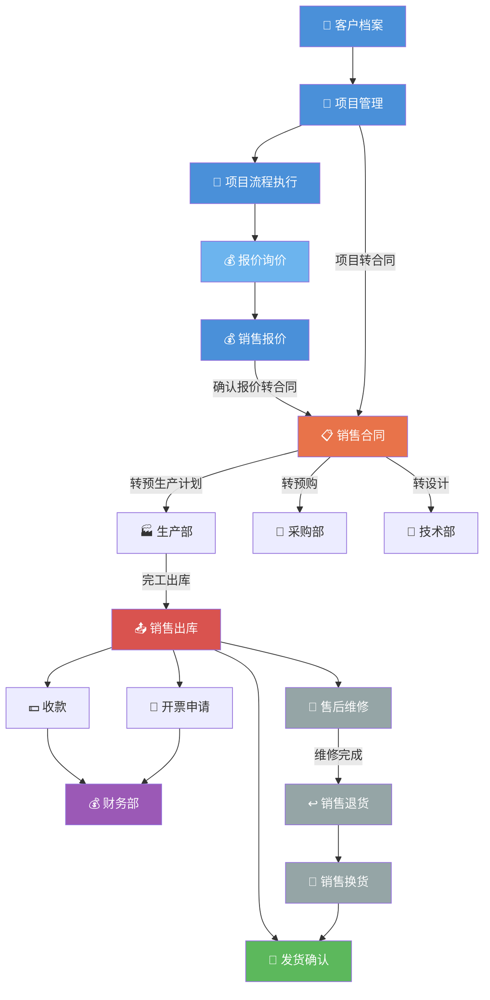

---
tags:
  - SUEL
  - ERP
  - 速易联
  - 销售
created: 2026-04-24
parent: "[[速易联ERP-操作总览]]"
---

> [!info] 📄 原始PDF文档
> [[福州速易联电气有限公司-销售流程.pdf|打开原始PDF]] ｜ [[速易联ERP-操作总览#📚 原始PDF文档|查看全部PDF]]

# 二、销售部功能要点

> 销售部是业务起点，核心流程：**客户→项目→报价→合同→出库→开票→回款**

---

## 1. 录入客户信息

### 直接添加客户

> [!quote] 📋 原始操作截图
> ![[01-项目/SUEL/速易联ERP/images/02-销售部/page_01.png|900]]

- 添加界面中**红色 * 号**为必填项
- 填写完成后，根据实际情况点击「领用」或「公用」

### 批量导入客户

> [!quote] 📋 原始操作截图
> ![[01-项目/SUEL/速易联ERP/images/02-销售部/page_02.png|900]]

1. 下载导入模板
2. 编辑好模板内容
3. 点击「浏览模板」选择编辑好的模板
4. 导入

---

## 2. 项目管理

### 直接添加项目

> [!quote] 📋 原始操作截图
> ![[01-项目/SUEL/速易联ERP/images/02-销售部/page_03.png|900]]

在项目管理中手动添加项目信息。

---

## 3. 项目流程执行

> [!quote] 📋 原始操作截图
> ![[01-项目/SUEL/速易联ERP/images/02-销售部/page_04.png|900]]

> [!quote] 📋 原始操作截图
> ![[01-项目/SUEL/速易联ERP/images/02-销售部/page_05.png|900]]

按照 [[13-上线准备手册#5.4 🔗 建立项目流程|项目流程模板]] 中配置的阶段逐步执行。

---

## 4. 项目生成报价

> [!quote] 📋 原始操作截图
> ![[01-项目/SUEL/速易联ERP/images/02-销售部/page_06.png|900]]

> [!quote] 📋 原始操作截图
> ![[01-项目/SUEL/速易联ERP/images/02-销售部/page_07.png|900]]

从项目直接生成报价单。

---

## 5. 报价添加

> [!quote] 📋 原始操作截图
> ![[01-项目/SUEL/速易联ERP/images/02-销售部/page_08.png|900]]

- 报价单中可**关联项目**
- 独立添加报价单时也可选择关联

---

## 6. 报价询价

> [!quote] 📋 原始操作截图
> ![[01-项目/SUEL/速易联ERP/images/02-销售部/page_09.png|900]]

> [!quote] 📋 原始操作截图
> ![[01-项目/SUEL/速易联ERP/images/02-销售部/page_10.png|900]]

向供应商或其他渠道进行询价。

---

## 7. 询价完成正式报价

> [!quote] 📋 原始操作截图
> ![[01-项目/SUEL/速易联ERP/images/02-销售部/page_11.png|900]]

询价完成后，确认正式报价单。

---

## 8. 报价转合同

> [!quote] 📋 原始操作截图
> ![[01-项目/SUEL/速易联ERP/images/02-销售部/page_12.png|900]]

- 如需关联项目，可拖至最下方关联项目

---

## 9. 项目转合同

> [!quote] 📋 原始操作截图
> ![[01-项目/SUEL/速易联ERP/images/02-销售部/page_13.png|900]]

从项目直接生成合同。

---

## 10. 合同添加

> [!quote] 📋 原始操作截图
> ![[01-项目/SUEL/速易联ERP/images/02-销售部/page_14.png|900]]

> [!quote] 📋 原始操作截图
> ![[01-项目/SUEL/速易联ERP/images/02-销售部/page_15.png|900]]

- 手动添加合同时，同样可关联项目（拖至合同页最下方）

---

## 11. 合同转预生产计划

> [!quote] 📋 原始操作截图
> ![[01-项目/SUEL/速易联ERP/images/02-销售部/page_16.png|900]]

> **要点**：合同列表 → 合同详情中点击「转预生产计划」按钮

合同确认后，转入生产部门的预生产计划。

---

## 12. 合同转预购

> [!quote] 📋 原始操作截图
> ![[01-项目/SUEL/速易联ERP/images/02-销售部/page_17.png|900]]

合同中涉及的采购需求转入预购单，由采购部跟进。

---

## 13. 合同转设计

> [!quote] 📋 原始操作截图
> ![[01-项目/SUEL/速易联ERP/images/02-销售部/page_18.png|900]]

将合同相关的设计需求转至技术部。

---

## 14. 开票申请

> [!quote] 📋 原始操作截图
> ![[01-项目/SUEL/速易联ERP/images/02-销售部/page_19.png|900]]

销售申请为客户开具发票。

---

## 15. 销售出库

> [!quote] 📋 原始操作截图
> ![[01-项目/SUEL/速易联ERP/images/02-销售部/page_20.png|900]]

产品出库给客户。

---

## 16. 维修单添加

> [!quote] 📋 原始操作截图
> ![[01-项目/SUEL/速易联ERP/images/02-销售部/page_21.png|900]]

> [!quote] 📋 原始操作截图
> ![[01-项目/SUEL/速易联ERP/images/02-销售部/page_22.png|900]]

> **要点**：只有**销售出库完成**的部分产品才可以进行售后维修

---

## 17. 维修部确认维修部件

> [!quote] 📋 原始操作截图
> ![[01-项目/SUEL/速易联ERP/images/02-销售部/page_23.png|900]]

> [!quote] 📋 原始操作截图
> ![[01-项目/SUEL/速易联ERP/images/02-销售部/page_24.png|900]]

维修部确认需要更换/维修的具体部件。

---

## 18. 销售退货流程

> [!quote] 📋 原始操作截图
> ![[01-项目/SUEL/速易联ERP/images/02-销售部/page_24.png|900]]

> [!quote] 📋 原始操作截图
> ![[01-项目/SUEL/速易联ERP/images/02-销售部/page_25.png|900]]

客户退货时的处理流程。

---

## 19. 销售退货入库流程

> [!quote] 📋 原始操作截图
> ![[01-项目/SUEL/速易联ERP/images/02-销售部/page_26.png|900]]

退货产品重新入库的流程。

---

## 相关链接

- 上级：[[速易联ERP-操作总览]]
- 上游：[[13-上线准备手册]]
- 下游：[[03-技术部操作指南]]、[[04-采购部操作指南]]、[[05-生产部操作指南]]

