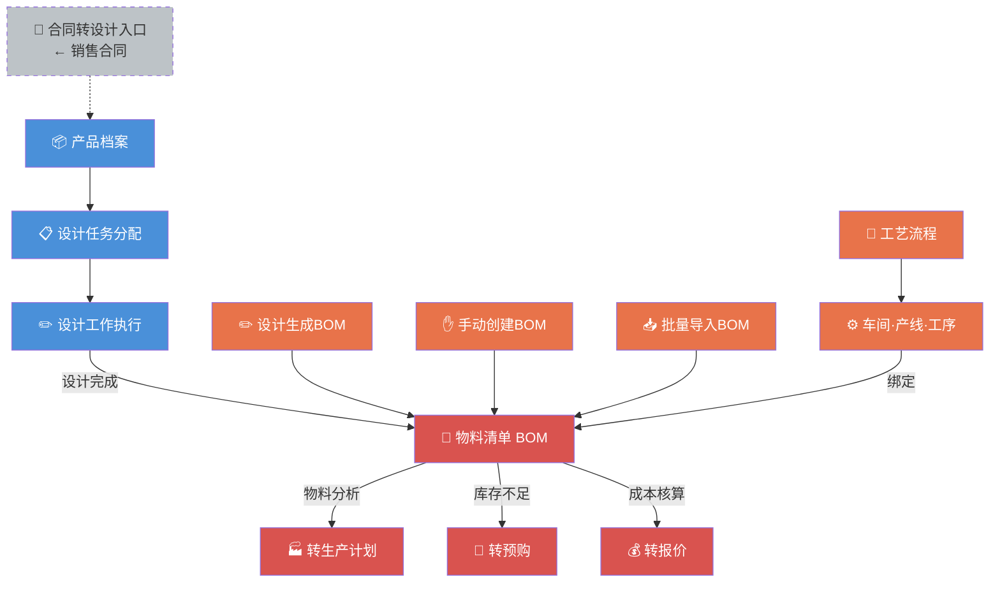
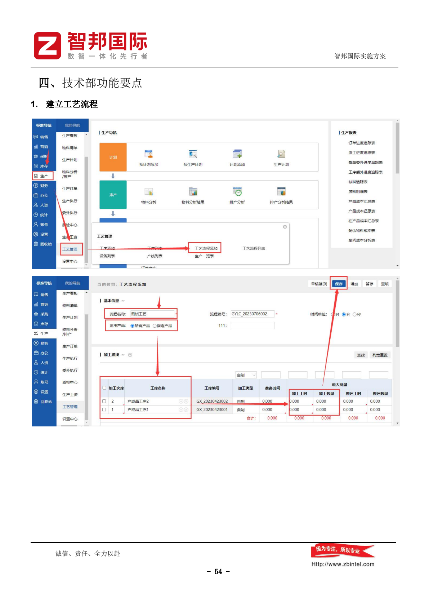
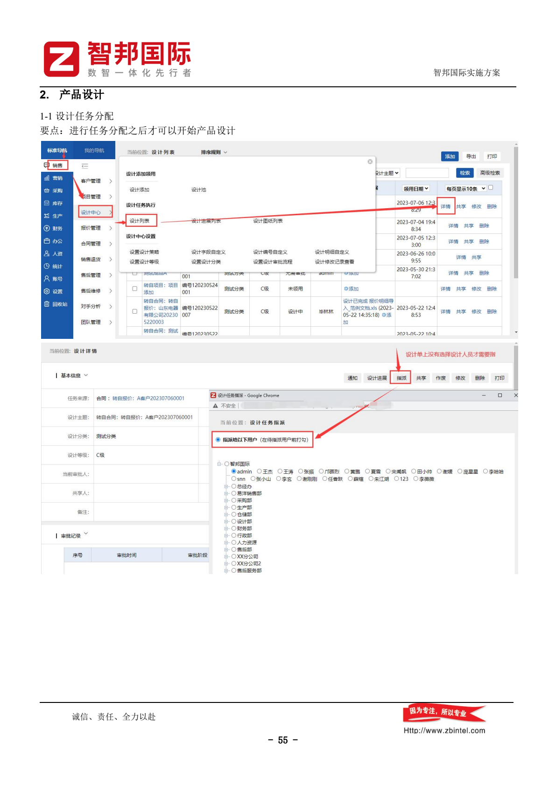
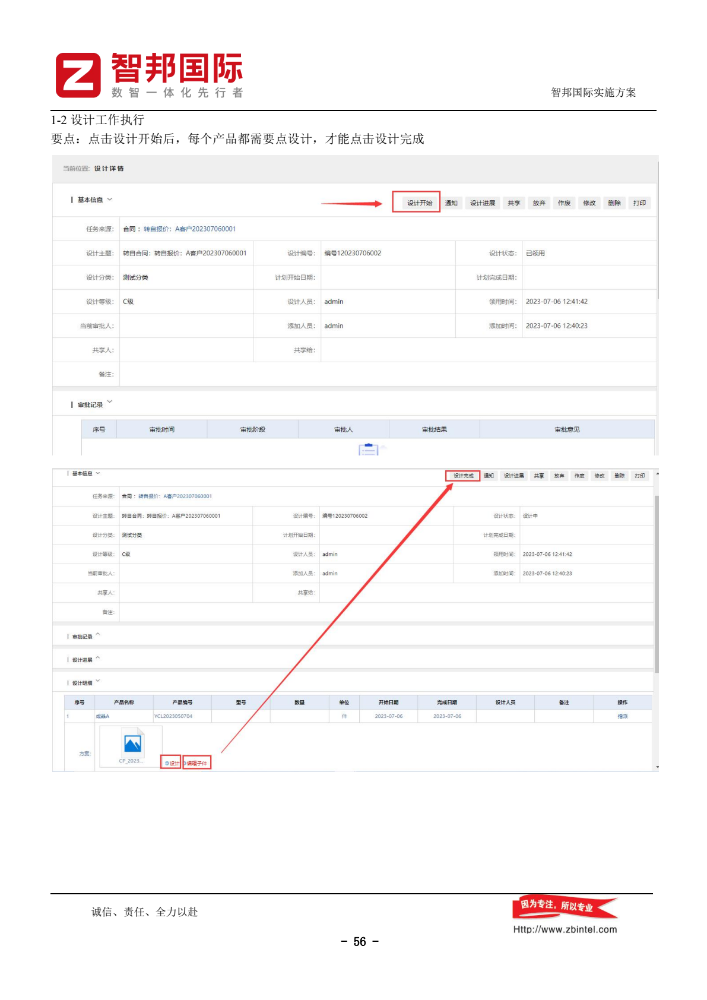
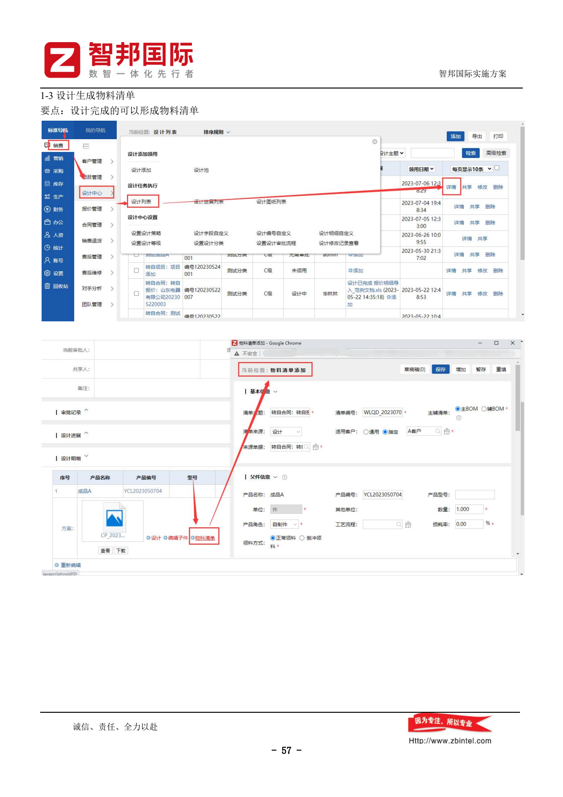
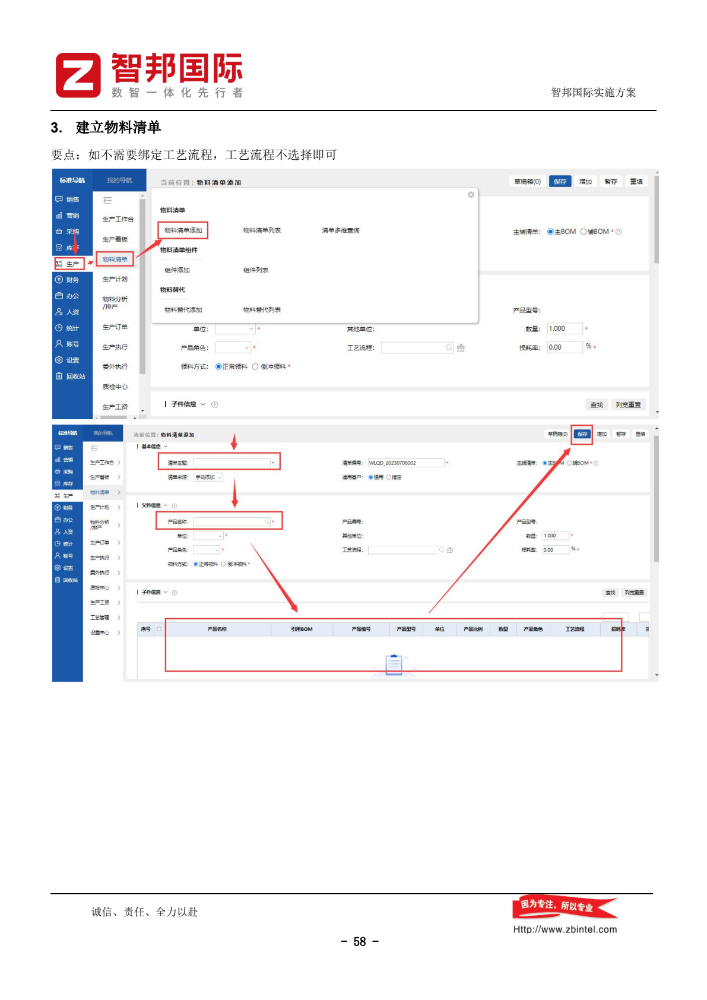
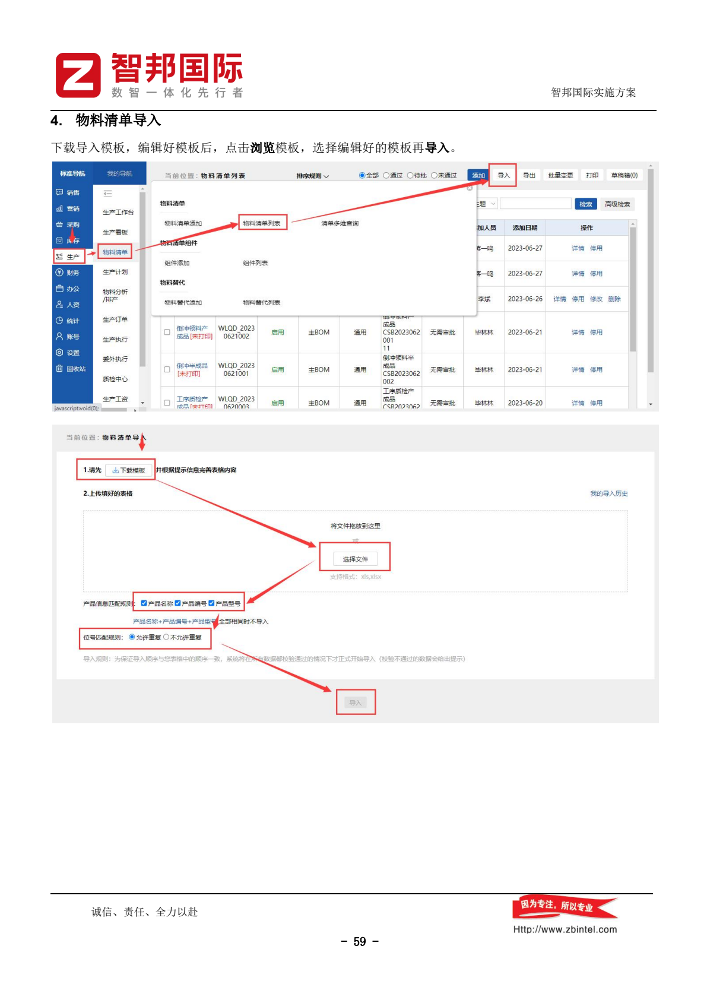

---
tags:
  - SUEL
  - ERP
  - 智邦国际
  - 技术
created: 2026-04-24
parent: "[[智邦国际ERP-操作总览]]"
---

> [!info] 📄 原始PDF文档
> 打开原始PDF ｜ [[智邦国际ERP-操作总览#📚 原始PDF文档|查看全部PDF]]

# 三、技术部功能要点

> 技术部负责产品设计、工艺流程、物料清单（BOM）管理。

---

## 1. 建立工艺流程

> [!quote] 📋 原始操作截图
> 

建立产品的生产工艺流程模板。

---

## 2. 产品设计

### 2-1 设计任务分配

> [!quote] 📋 原始操作截图
> 

> **要点**：进行任务分配之后才可以开始产品设计

### 2-2 设计工作执行

> [!quote] 📋 原始操作截图
> 

> **要点**：点击「设计开始」后，**每个产品都需要点击「设计」**，才能点击「设计完成」

### 2-3 设计生成物料清单

> [!quote] 📋 原始操作截图
> 

> **要点**：设计完成的可以形成物料清单

---

## 3. 建立物料清单（BOM）

> [!quote] 📋 原始操作截图
> 

> **要点**：如不需要绑定工艺流程，工艺流程不选择即可

手动创建产品的物料清单。

---

## 4. 物料清单导入

> [!quote] 📋 原始操作截图
> 

批量导入物料清单：

1. 下载导入模板
2. 编辑好模板内容
3. 点击「浏览模板」选择编辑好的模板
4. 导入

---

## 相关链接

- 上级：[[智邦国际ERP-操作总览]]
- 上游：[[02-销售部操作指南]]（合同转设计）
- 下游：[[05-生产部操作指南]]（物料清单用于生产计划）

