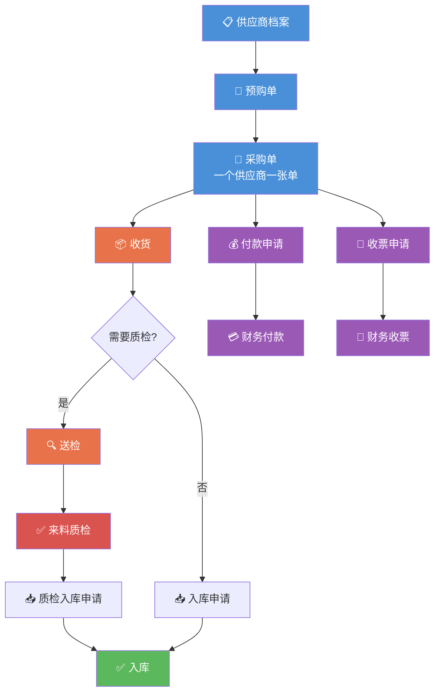
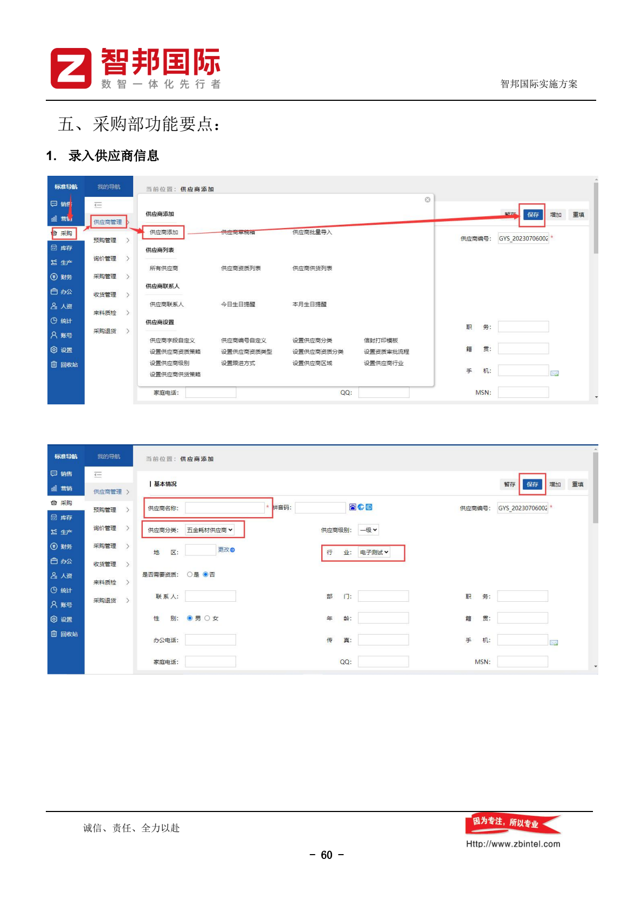
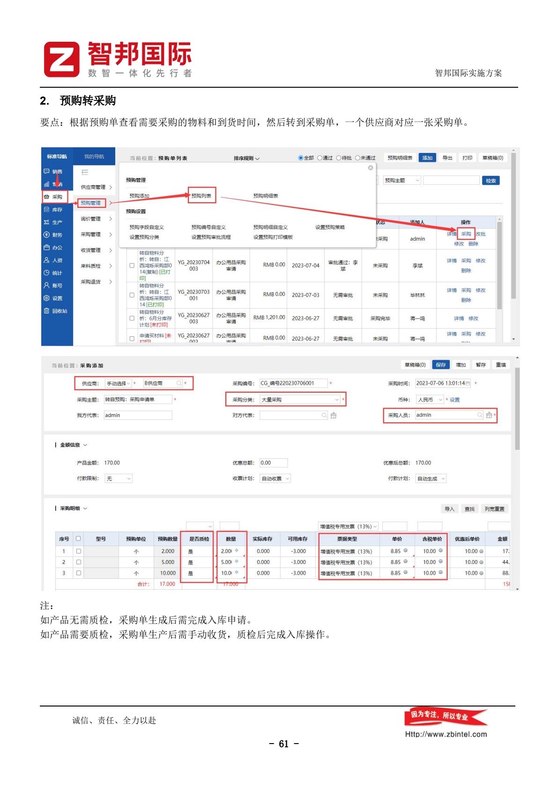
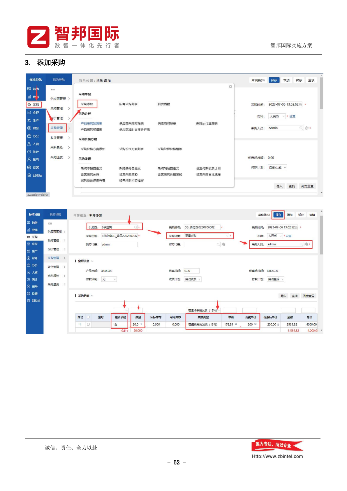
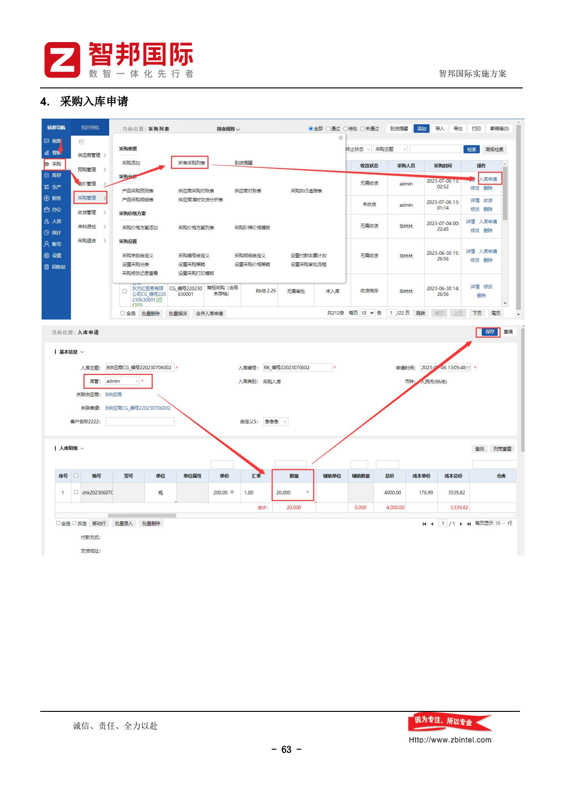
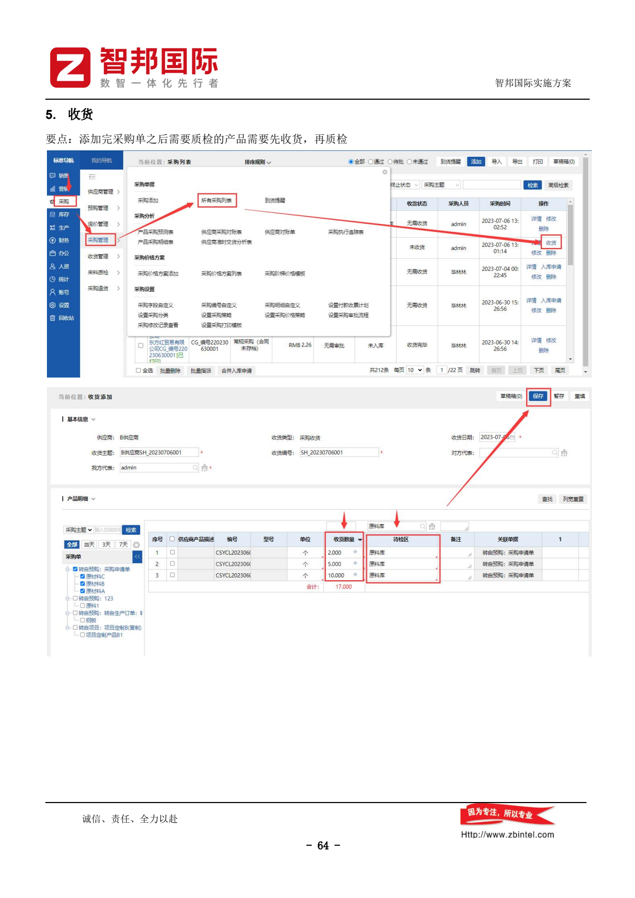
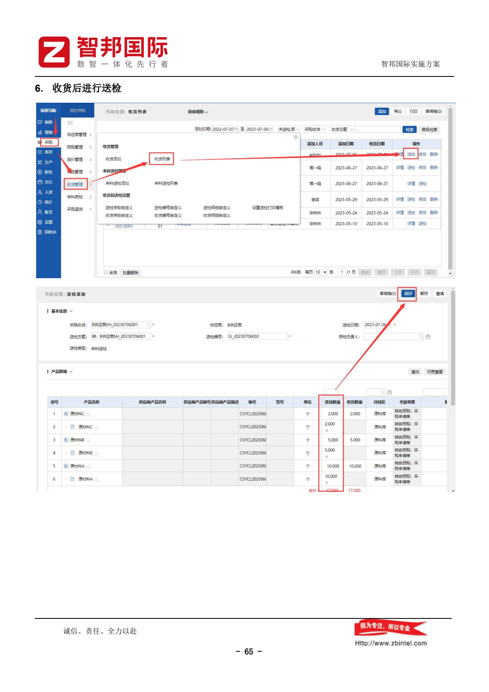
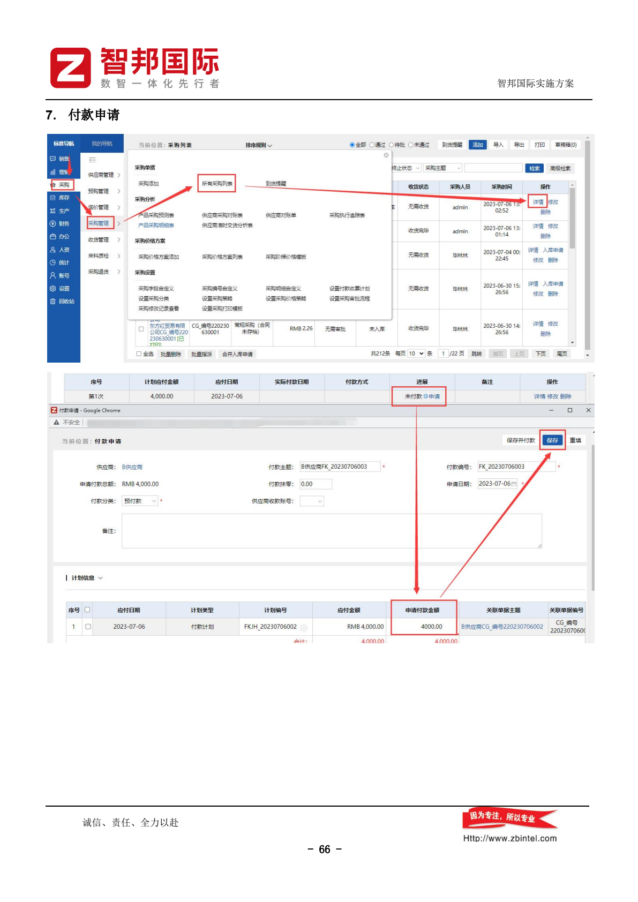
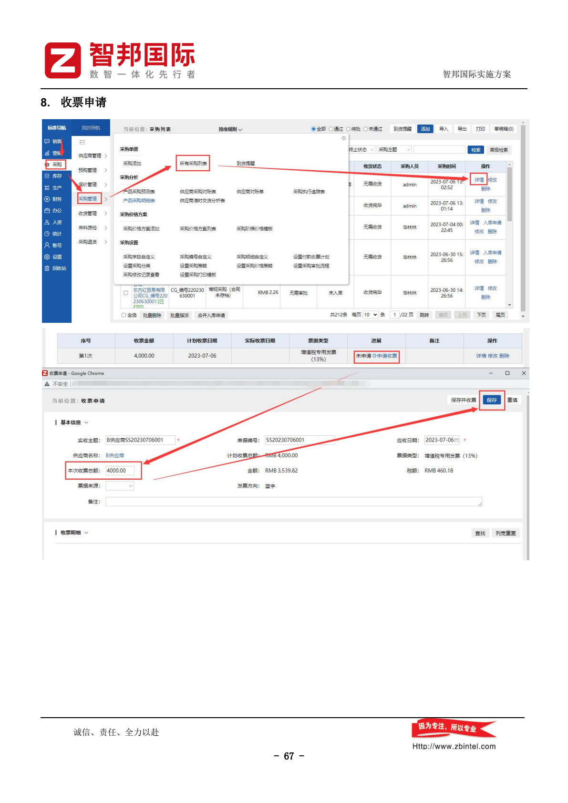

---
tags:
  - SUEL
  - ERP
  - 智邦国际
  - 采购
created: 2026-04-24
parent: "[[智邦国际ERP-操作总览]]"
---

> [!info] 📄 原始PDF文档
> 打开原始PDF ｜ [[智邦国际ERP-操作总览#📚 原始PDF文档|查看全部PDF]]

# 四、采购部功能要点

> 采购部负责供应商管理、采购执行、收货质检、付款。

---

## 1. 录入供应商信息

> [!quote] 📋 原始操作截图
> 

添加供应商基本信息。

---

## 2. 预购转采购

> [!quote] 📋 原始操作截图
> 

> **要点**：根据预购单查看需要采购的物料和到货时间，然后转到采购单。**一个供应商对应一张采购单**。

### 质检规则：
- **无需质检**的产品：采购单生成后需完成入库申请
- **需要质检**的产品：采购单生成后需手动收货，质检后完成入库操作

---

## 3. 添加采购

> [!quote] 📋 原始操作截图
> 

手动添加采购单。

---

## 4. 采购入库申请

> [!quote] 📋 原始操作截图
> 

> 参见质检规则，需质检的先收货质检再入库。

---

## 5. 收货

> [!quote] 📋 原始操作截图
> 

> **要点**：添加完采购单之后需要质检的产品需要**先收货，再质检**

---

## 6. 收货后进行送检

> [!quote] 📋 原始操作截图
> 

将收货提交至质检部门。

---

## 7. 付款申请

> [!quote] 📋 原始操作截图
> 

在应付账款列表提交付款申请。

---

## 8. 收票申请

> [!quote] 📋 原始操作截图
> 

> **要点**：由采购先在收票计划列表进行收票申请，然后财务收票

---

## 相关链接

- 上级：[[智邦国际ERP-操作总览]]
- 上游：[[02-销售部操作指南]]（合同转预购）、[[05-生产部操作指南]]（生产订单转预购）
- 下游：[[06-质检部操作指南]]（来料质检）、[[08-财务部操作指南]]（付款/收票）

