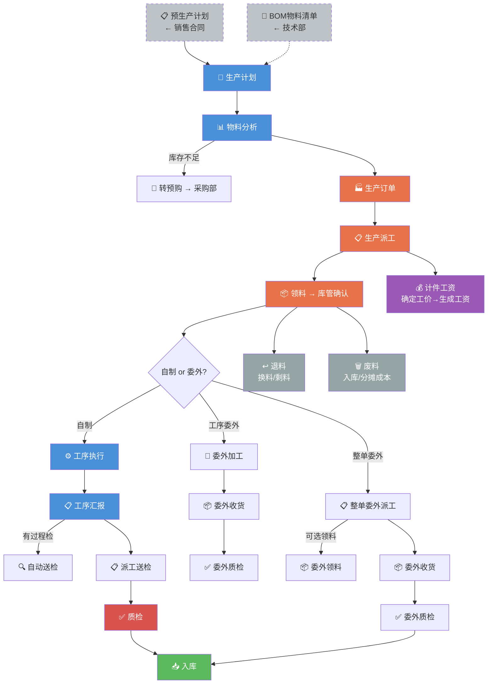

---
tags:
  - SUEL
  - ERP
  - 智邦国际
  - 生产
created: 2026-04-24
parent: "[[智邦国际ERP-操作总览]]"
---

> [!info] 📄 原始PDF文档
> [[pdfs/福州速易联电气有限公司-生产.pdf|打开原始PDF]] ｜ [[智邦国际ERP-操作总览#📚 原始PDF文档|查看全部PDF]]

# 五、生产部功能要点

> 生产部是最复杂的模块，涵盖：生产计划→物料分析→派工→工序执行→质检→入库→计件工资

---

## 1. 建立生产计划

> [!quote] 📋 原始操作截图
> ![[images/05-生产部/page_01.png|900]]

> **要点**：预生产计划列表可以查看到合同转过来的预生产计划，然后根据预生产计划生成生产计划。也可以手动添加生产计划（选择计划型），注意**物料清单选择**，保存之后系统自动提示是否进行物料分析。

---

## 2. 进行物料分析

> [!quote] 📋 原始操作截图
> ![[images/05-生产部/page_02.png|900]]

> **要点**：选择分析策略，分析完毕之后：
> - 库存**不足**的显示应自制数量、应采购数量
> - 库存**充足**的数量为 0
> - 分析完物料之后直接点击「生产订单」

---

## 3. 转生产订单

> [!quote] 📋 原始操作截图
> ![[images/05-生产部/page_03.png|900]]

根据物料分析结果生成生产订单。

---

## 4. 生产订单转预购

> [!quote] 📋 原始操作截图
> ![[images/05-生产部/page_04.png|900]]

库存不足的物料转入预购，由采购部跟进。

---

## 5. 生产派工

> [!quote] 📋 原始操作截图
> ![[images/05-生产部/page_05.png|900]]

> **要点**：选择被派人员，注意产品名称，哪个产品派工给哪个车间负责人。如果保存不了，往后面拉一下看是否要求填写批号、序列号之类的内容。

---

## 6. 领料

> [!quote] 📋 原始操作截图
> ![[images/05-生产部/page_06.png|900]]

> **要点**：在派工列表中找到对应派工单点击详情，选择「领料」，选择对应的库管，将单据传至库管。

---

## 7. 直接领料

> [!quote] 📋 原始操作截图
> ![[images/05-生产部/page_07.png|900]]

> **注**：只限于对**低值易耗品**的领用以及**不在物料清单中**添加的产品的领用

---

## 8. 派工完入库（无需质检）

> [!quote] 📋 原始操作截图
> ![[images/05-生产部/page_08.png|900]]

无需质检的产品，派工完成后直接入库。

---

## 9. 修改派工单

> **要点**：对已创建的派工单进行修改。

---

## 10. 派工交底

> [!quote] 📋 原始操作截图
> ![[images/05-生产部/page_09.png|900]]

> **要点**：派工单生成周转码，然后打印后交给对应工人进行生产

---

## 11. 执行工序

> [!quote] 📋 原始操作截图
> ![[images/05-生产部/page_10.png|900]]

> **要点**：领料完毕的实际开始加工生产，然后进行工序汇报。一道工序一道工序选择生产人员，保存汇报完成。

---

## 12. 按单汇报

> [!quote] 📋 原始操作截图
> ![[images/05-生产部/page_11.png|900]]

对单个工序进行汇报。

> **注**：如存在过程检，该工序汇报后自动送检。

---

## 13. 工序委外

> [!quote] 📋 原始操作截图
> ![[images/05-生产部/page_12.png|900]]

> [!quote] 📋 原始操作截图
> ![[images/05-生产部/page_13.png|900]]

> [!quote] 📋 原始操作截图
> ![[images/05-生产部/page_14.png|900]]

将某个工序委托外部加工。

---

## 14. 工序委外收货

> [!quote] 📋 原始操作截图
> ![[images/05-生产部/page_15.png|900]]

> **注**：已设定工序委外收货后，自动送检。

---

## 15. 派工送检

> [!quote] 📋 原始操作截图
> ![[images/05-生产部/page_16.png|900]]

将派工产品提交质检。

---

## 16. 整单委外派工

> **要点**：委外派工可选是否领料。如需领料则进行领料，如无需领料则跳过。

---

## 17. 委外领料

> [!quote] 📋 原始操作截图
> ![[images/05-生产部/page_17.png|900]]

整单委外时的领料操作。

---

## 18. 委外收货

> [!quote] 📋 原始操作截图
> ![[images/05-生产部/page_18.png|900]]

> [!quote] 📋 原始操作截图
> ![[images/05-生产部/page_19.png|900]]

> **注**：整单委外收货后，可设置为自动送检。

---

## 19. 物料登记

> [!quote] 📋 原始操作截图
> ![[images/05-生产部/page_20.png|900]]

> **要点**：正常按单领料之后，系统会自动登记。只有不正常情况（如忘记领料、部分领料、退料废料等）才需要手动登记。

---

## 20. 耗材登记

> [!quote] 📋 原始操作截图
> ![[images/05-生产部/page_21.png|900]]

> **要点**：登记的是物料清单中没有的那些耗材的使用情况，是通过直接领料功能领出来的。

---

## 21. 生产退料

> [!quote] 📋 原始操作截图
> ![[images/05-生产部/page_22.png|900]]

> [!quote] 📋 原始操作截图
> ![[images/05-生产部/page_23.png|900]]

> **要点**：打开对应领料单详情 → 点「退料」：
> - 原料问题需替换 → 点「换料退回」
> - 领多了 → 点「剩料退回」
> - **保存后记得申请入库**

---

## 22. 生产废料

> [!quote] 📋 原始操作截图
> ![[images/05-生产部/page_24.png|900]]

> **要点**：打开对应领料单详情 → 点「废料」：
> - 需要入库的废料 → 成本计入废掉的原材料，**保存后记得申请入库**
> - 无需入库的废料 → 适用于月底分摊生产成本

---

## 23. 计件工资添加

### 23-1 确定工价

> [!quote] 📋 原始操作截图
> ![[images/05-生产部/page_25.png|900]]

### 23-2 生成计件工资

> [!quote] 📋 原始操作截图
> ![[images/05-生产部/page_26.png|900]]

> [!quote] 📋 原始操作截图
> ![[images/05-生产部/page_27.png|900]]

---

## 相关链接

- 上级：[[智邦国际ERP-操作总览]]
- 上游：[[02-销售部操作指南]]（合同转预生产计划）、[[03-技术部操作指南]]（物料清单）
- 下游：[[04-采购部操作指南]]（生产订单转预购）、[[06-质检部操作指南]]、[[07-库房操作指南]]

