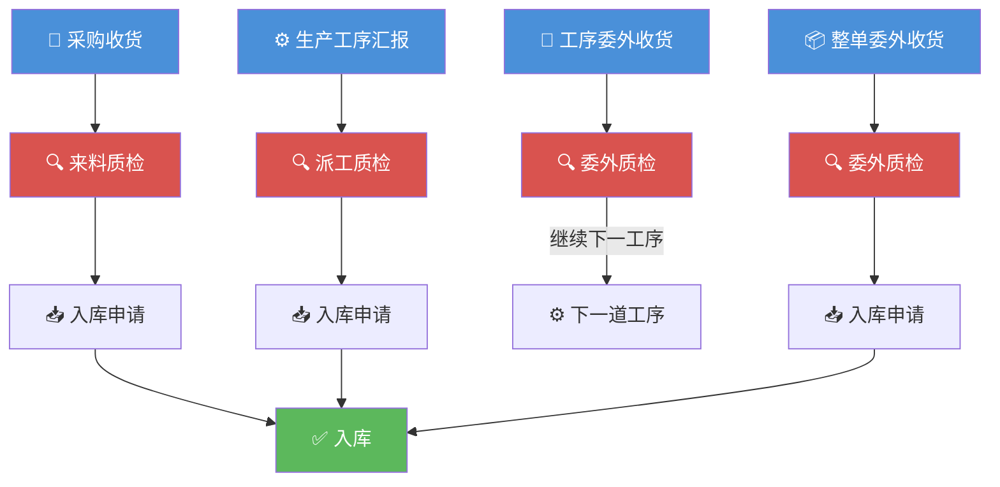

---
tags:
  - SUEL
  - ERP
  - 智邦国际
  - 质检
created: 2026-04-24
parent: "[[智邦国际ERP-操作总览]]"
---

> [!info] 📄 原始PDF文档
> [[pdfs/福州速易联电气有限公司-质检.pdf|打开原始PDF]] ｜ [[智邦国际ERP-操作总览#📚 原始PDF文档|查看全部PDF]]

# 六、质检部功能要点

> 质检部负责三大类质检：来料质检、派工生产质检、委外质检。

---

## 1. 来料质检

> [!quote] 📋 原始操作截图
> ![[images/06-质检部/page_01.png|900]]

> [!quote] 📋 原始操作截图
> ![[images/06-质检部/page_02.png|900]]

> **要点**：在「来料质检任务」中进行质检。质检完成后提交入库。

**流程**：
1. 在来料质检任务中进行质检
2. 质检完成后进行入库申请

---

## 2. 派工生产质检

> [!quote] 📋 原始操作截图
> ![[images/06-质检部/page_03.png|900]]

> [!quote] 📋 原始操作截图
> ![[images/06-质检部/page_04.png|900]]

> **要点**：在「派工质检任务」中进行质检。

**流程**：
1. 在派工质检任务中进行质检
2. 质检后进行入库申请

---

## 3. 委外质检

> [!quote] 📋 原始操作截图
> ![[images/06-质检部/page_05.png|900]]

> **要点**：在「委外质检任务」中进行质检。

**区别**：
- **工序委外质检**：无需入库申请（继续下一道工序）
- **整单委外质检**：质检后需完成入库申请

---

## 相关链接

- 上级：[[智邦国际ERP-操作总览]]
- 上游：[[04-采购部操作指南]]（来料质检）、[[05-生产部操作指南]]（派工质检/委外质检）
- 下游：[[07-库房操作指南]]（质检后入库）

