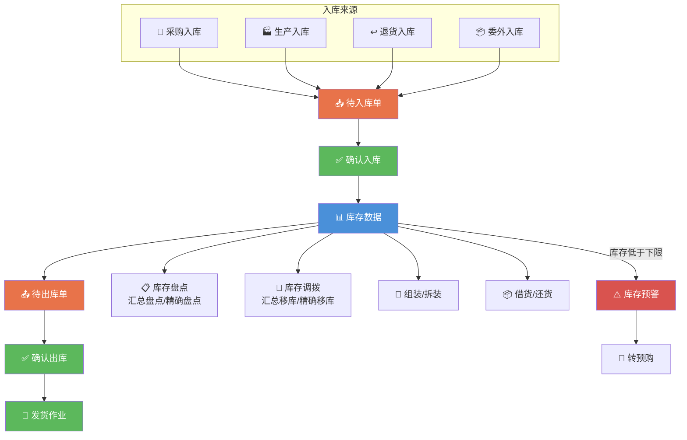

---
tags:
  - SUEL
  - ERP
  - 速易联
  - 库房
created: 2026-04-24
parent: "[[速易联ERP-操作总览]]"
---

> [!info] 📄 原始PDF文档
> [[福州速易联电气有限公司-仓库.pdf|打开原始PDF]] ｜ [[速易联ERP-操作总览#📚 原始PDF文档|查看全部PDF]]

# 七、库房功能要点

> 库房管理是物资流转的枢纽，统一管理入库/出库/盘点/调拨等。

---

## 1. 入库作业

> [!quote] 📋 原始操作截图
> ![[01-项目/SUEL/速易联ERP/images/07-库房/page_01.png|900]]

> **要点**：收到各种来源的入库申请，统一在「待入库单」中确认入库

---

## 2. 出库作业

> [!quote] 📋 原始操作截图
> ![[01-项目/SUEL/速易联ERP/images/07-库房/page_02.png|900]]

> **要点**：收到各种来源的出库申请，统一在「待出库单」中确认出库

---

## 3. 发货作业

> **要点**：只有**出库完毕**后还需要管理发货过程才需要进行此项工作

### 3-1 发货申请

> [!quote] 📋 原始操作截图
> ![[01-项目/SUEL/速易联ERP/images/07-库房/page_03.png|900]]

### 3-2 发货确认

> [!quote] 📋 原始操作截图
> ![[01-项目/SUEL/速易联ERP/images/07-库房/page_04.png|900]]

---

## 4. 库存盘点

### 汇总盘点

> [!quote] 📋 原始操作截图
> ![[01-项目/SUEL/速易联ERP/images/07-库房/page_05.png|900]]

### 精确盘点

> [!quote] 📋 原始操作截图
> ![[01-项目/SUEL/速易联ERP/images/07-库房/page_06.png|900]]

---

## 5. 库存调拨

### 汇总移库

> [!quote] 📋 原始操作截图
> ![[01-项目/SUEL/速易联ERP/images/07-库房/page_07.png|900]]

### 精确移库

> [!quote] 📋 原始操作截图
> ![[01-项目/SUEL/速易联ERP/images/07-库房/page_08.png|900]]

---

## 6. 组装拆装

### 6-1 添加组装清单

> [!quote] 📋 原始操作截图
> ![[01-项目/SUEL/速易联ERP/images/07-库房/page_09.png|900]]

### 6-2 添加组装

> **适用场景**：仓库中有需要淘汰的产品，转换为可正常使用的产品

> [!quote] 📋 原始操作截图
> ![[01-项目/SUEL/速易联ERP/images/07-库房/page_10.png|900]]

> [!quote] 📋 原始操作截图
> ![[01-项目/SUEL/速易联ERP/images/07-库房/page_11.png|900]]

### 6-3 添加拆装

> **适用场景**：仓库中有正常使用的产品，拆解为需要的产品

> [!quote] 📋 原始操作截图
> ![[01-项目/SUEL/速易联ERP/images/07-库房/page_12.png|900]]

> [!quote] 📋 原始操作截图
> ![[01-项目/SUEL/速易联ERP/images/07-库房/page_13.png|900]]

---

## 7. 借货管理

### 7-1 借货

> [!quote] 📋 原始操作截图
> ![[01-项目/SUEL/速易联ERP/images/07-库房/page_14.png|900]]

> [!quote] 📋 原始操作截图
> ![[01-项目/SUEL/速易联ERP/images/07-库房/page_15.png|900]]

### 7-2 还货

> [!quote] 📋 原始操作截图
> ![[01-项目/SUEL/速易联ERP/images/07-库房/page_16.png|900]]

> [!quote] 📋 原始操作截图
> ![[01-项目/SUEL/速易联ERP/images/07-库房/page_17.png|900]]

### 7-3 借货转销售合同

> [!quote] 📋 原始操作截图
> ![[01-项目/SUEL/速易联ERP/images/07-库房/page_18.png|900]]

---

## 8. 库存预警转预购

> [!quote] 📋 原始操作截图
> ![[01-项目/SUEL/速易联ERP/images/07-库房/page_18.png|900]]

> **要点**：设定库存上下限后，可进行库存预警转预购

---

## 相关链接

- 上级：[[速易联ERP-操作总览]]
- 上游：[[04-采购部操作指南]]、[[05-生产部操作指南]]、[[06-质检部操作指南]]
- 关联：[[08-财务部操作指南]]

