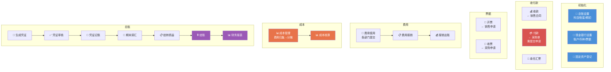

---
tags:
  - SUEL
  - ERP
  - 智邦国际
  - 财务
created: 2026-04-24
parent: "[[智邦国际ERP-操作总览]]"
---

> [!info] 📄 原始PDF文档
> [[pdfs/福州速易联电气有限公司-财务.pdf|打开原始PDF]] ｜ [[智邦国际ERP-操作总览#📚 原始PDF文档|查看全部PDF]]

# 八、财务部功能要点

> 财务部涵盖总账、收付款、票据、费用、固定资产、成本管理全流程。

---

## 1. 总账设置

> [!quote] 📋 原始操作截图
> ![[images/08-财务部/page_01.png|900]]

> **要点**：账套、科目、科目对接，录入期初账户余额，期初应收，期初应付，科目余额表

---

## 2. 现金银行设置

> **要点**：设置银行账户、票据类型、主管出纳、币种等。

> [!quote] 📋 原始操作截图
> ![[images/08-财务部/page_02.png|900]]

### 设置银行账户

> [!quote] 📋 原始操作截图
> ![[images/08-财务部/page_03.png|900]]

---

## 3. 承兑汇票处理

### 3-1 承兑汇票添加

> [!quote] 📋 原始操作截图
> ![[images/08-财务部/page_04.png|900]]

### 3-2 承兑汇票抵应收

> [!quote] 📋 原始操作截图
> ![[images/08-财务部/page_05.png|900]]

### 3-3 票据找零（应收）

> [!quote] 📋 原始操作截图
> ![[images/08-财务部/page_06.png|900]]

> [!quote] 📋 原始操作截图
> ![[images/08-财务部/page_07.png|900]]

### 3-4 填写背书转让信息

> [!quote] 📋 原始操作截图
> ![[images/08-财务部/page_08.png|900]]

### 3-5 承兑汇票抵应付

> [!quote] 📋 原始操作截图
> ![[images/08-财务部/page_09.png|900]]

### 3-6 票据找零（应付）

> [!quote] 📋 原始操作截图
> ![[images/08-财务部/page_10.png|900]]

> [!quote] 📋 原始操作截图
> ![[images/08-财务部/page_11.png|900]]

---

## 4. 收款

> [!quote] 📋 原始操作截图
> ![[images/08-财务部/page_12.png|900]]

> **要点**：财务模块收款列表对应的是销售合同。只有合同建立收款才会有对应合同金额的收款单，实际收到之后需要操作收款。

---

## 5. 付款

> [!quote] 📋 原始操作截图
> ![[images/08-财务部/page_13.png|900]]

> **要点**：付款管理和收款管理功能一致，只是付款对应的是采购。建立采购单并录入价格后付款管理才会有付款单。需要在应付账款列表提交申请，然后进行付款。

---

## 6. 开票

> [!quote] 📋 原始操作截图
> ![[images/08-财务部/page_14.png|900]]

> **要点**：由销售先在「开票计划」列表进行申请开票，然后财务进行实际开票。

---

## 7. 收票

> [!quote] 📋 原始操作截图
> ![[images/08-财务部/page_15.png|900]]

> **要点**：由采购先在「收票计划」列表进行收票申请，然后财务收票。

---

## 8. 费用管理

> [!quote] 📋 原始操作截图
> ![[images/08-财务部/page_16.png|900]]

> **要点**：费用来源是各部门提交的报销。可关联合同、采购单、生产订单、发货单，也可不关联。
>
> **流程**：费用使用 → 费用报销 → 财务出账

### 8-1 添加使用

> [!quote] 📋 原始操作截图
> ![[images/08-财务部/page_17.png|900]]

### 8-2 添加报销
### 8-3 报销出账

> [!quote] 📋 原始操作截图
> ![[images/08-财务部/page_18.png|900]]

> [!quote] 📋 原始操作截图
> ![[images/08-财务部/page_19.png|900]]

---

## 9. 暂估和在产品处理

> [!quote] 📋 原始操作截图
> ![[images/08-财务部/page_20.png|900]]

> **要点**：收票后，出现货票不一致时进行暂估成本调整

### 录入在产品完工进度

> [!quote] 📋 原始操作截图
> ![[images/08-财务部/page_21.png|900]]

---

## 10. 固定资产管理

### 10-1 固定资产添加

> [!quote] 📋 原始操作截图
> ![[images/08-财务部/page_22.png|900]]

> [!quote] 📋 原始操作截图
> ![[images/08-财务部/page_23.png|900]]

> [!quote] 📋 原始操作截图
> ![[images/08-财务部/page_24.png|900]]

> **要点**：启用日期是指系统中启用日期。如希望 12 月开始计提折旧，则启用日期放到 11 月的某天。

### 10-2 计提折旧

> [!quote] 📋 原始操作截图
> ![[images/08-财务部/page_25.png|900]]

---

## 11. 成本管理

> [!quote] 📋 原始操作截图
> ![[images/08-财务部/page_26.png|900]]

> **要点**：先进行费用归集，再进行费用分摊。
>
> **直接费用**（水电费、机器维修费等）：在部门间费用或订单间费用中手动添加（添加费用使用单后需报销，在费用管理模块下的报销列表进行出账）。
>
> **其他制造费用、工资**：直接归集后进行分摊。

### 11-1 直接费用添加

> [!quote] 📋 原始操作截图
> ![[images/08-财务部/page_27.png|900]]

### 11-2 直接费用报销
### 11-3 直接费用出账

### 11-4 其他制造费用归集

> [!quote] 📋 原始操作截图
> ![[images/08-财务部/page_28.png|900]]

> [!quote] 📋 原始操作截图
> ![[images/08-财务部/page_29.png|900]]

### 11-5 工资及折旧归集

> [!quote] 📋 原始操作截图
> ![[images/08-财务部/page_30.png|900]]

---

## 12. 成本核算

> [!quote] 📋 原始操作截图
> ![[images/08-财务部/page_31.png|900]]

> **要点**：点击「成本核算」→ 选择当月 → 根据提示处理异常 → 完成后查看核算报表

---

## 13. 总账管理

### 13-1 生成凭证

> [!quote] 📋 原始操作截图
> ![[images/08-财务部/page_32.png|900]]

> **要点**：如果生成凭证失败，或借贷科目不正确：
> 1. 至「对接设置」中进行设置
> 2. 如需添加辅助核算，在「会计科目」中修改科目属性

### 13-2 凭证审核
### 13-3 凭证记账

> [!quote] 📋 原始操作截图
> ![[images/08-财务部/page_33.png|900]]

### 13-4 期末调汇

> [!quote] 📋 原始操作截图
> ![[images/08-财务部/page_34.png|900]]

### 13-5 结转损益

> [!quote] 📋 原始操作截图
> ![[images/08-财务部/page_35.png|900]]

### 13-6 结账

> [!quote] 📋 原始操作截图
> ![[images/08-财务部/page_36.png|900]]

### 13-7 各种财务报表

> [!quote] 📋 原始操作截图
> ![[images/08-财务部/page_37.png|900]]

---

## 相关链接

- 上级：[[智邦国际ERP-操作总览]]
- 上游：[[02-销售部操作指南]]（收款/开票）、[[04-采购部操作指南]]（付款/收票）、[[07-库房操作指南]]
- 关联：[[10-人资部操作指南]]（工资归集）

