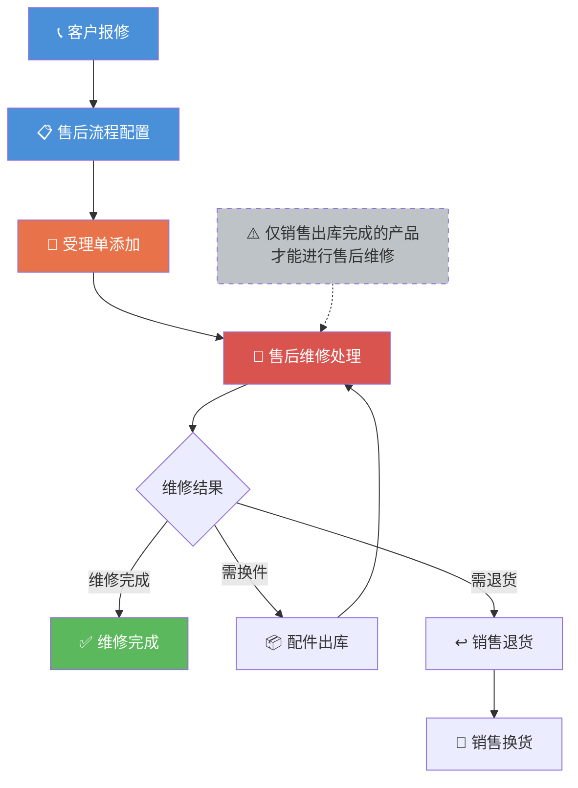

---
tags:
  - SUEL
  - ERP
  - 速易联
  - 售后
created: 2026-04-24
parent: "[[速易联ERP-操作总览]]"
---

> [!info] 📄 原始PDF文档
> [[福州速易联电气有限公司-售后.pdf|打开原始PDF]] ｜ [[速易联ERP-操作总览#📚 原始PDF文档|查看全部PDF]]

# 九、售后部功能要点

> 售后部负责售后服务流程管理和维修处理。

---

## 1. 建立售后流程

> [!quote] 📋 原始操作截图
> ![[01-项目/SUEL/速易联ERP/images/09-售后部/page_01.png|900]]

配置售后服务阶段和处理流程。

---

## 2. 受理单添加

> [!quote] 📋 原始操作截图
> ![[01-项目/SUEL/速易联ERP/images/09-售后部/page_02.png|900]]

客户报修后创建受理单。

---

## 3. 售后维修

> [!quote] 📋 原始操作截图
> ![[01-项目/SUEL/速易联ERP/images/09-售后部/page_03.png|900]]

> [!quote] 📋 原始操作截图
> ![[01-项目/SUEL/速易联ERP/images/09-售后部/page_04.png|900]]

> **要点**：接到受理单后，按照阶段进行处理

> **注意**：只有**销售出库完成**的部分产品才可以进行售后维修

---

## 相关链接

- 上级：[[速易联ERP-操作总览]]
- 上游：[[02-销售部操作指南]]（销售出库后的产品才能维修）
