---
tags:
  - SUEL
  - ERP
  - 速易联
  - 基础配置
  - 上线清单
created: 2026-04-25
parent: "[[速易联ERP-操作总览]]"
---

> [!info] 📄 原始PDF文档
> [[福州速易联电气有限公司-基础信息建立.pdf|打开基础信息建立PDF]] ｜ [[福州速易联电气有限公司-实施方案.pdf|打开实施方案PDF]] ｜ [[速易联ERP-操作总览#📚 原始PDF文档|查看全部PDF]]
> 📋 基础信息建立操作截图详见 → [[01-基础信息建立操作指南]]


# 速易联ERP — 上线准备手册

> 系统上线前需完成的全部配置工作，按**依赖顺序**分六阶段推进。
> 标注 ⭐ 为必录项，标注 🔗 表示有前后依赖关系。
> 🔑 权限配置详见 → [[14-权限分配矩阵]]

---

## 📋 总览：六阶段录入路线图

```mermaid
flowchart TD
    subgraph S1["第一阶段：系统初始化"]
        A1["🏢 组织架构\n建立部门/岗位层级"]
        A2["👤 员工档案 + 账号\n先建档案→自动生成账号→激活"]
        A3["🔐 权限模板\n各岗位功能权限 + 数据权限"]
    end

    subgraph S2["第二阶段：业务基础数据"]
        B1["👥 客户档案\n支持批量导入"]
        B2["🏭 供应商档案\n一个供应商→一张采购单"]
        B3["📦 产品分类 + 产品信息\nBOM/报价/合同的基础"]
    end

    subgraph S3["第三阶段：生产 + 仓储配置"]
        C1["🏗️ 仓库分类 + 仓库\n按类型分类管理"]
        C2["📊 期初库存\n需盘点核实"]
        C3["🔧 车间 → 产线 → 工序\n工序绑定到产线才能派工"]
        C4["📋 工艺流程模板\n可绑定到BOM"]
    end

    subgraph S4["第四阶段：财务初始化"]
        D1["📒 总账科目设置\n需录入期初数据"]
        D2["🏦 银行账户\n主管出纳指定"]
        D3["💵 票据类型 + 币种"]
        D4["💰 期初余额\n应收应付账款"]
    end

    subgraph S5["第五阶段：人资 + 审批配置"]
        E1["⏰ 班次 + 班组\n排班管理"]
        E2["💰 工资项目 + 账套\n项目先设，再组合成账套"]
        E3["📋 项目流程模板\n项目阶段定义"]
        E4["✅ 审批流程\n按业务模块分别配置"]
    end

    subgraph S6["第六阶段：业务校验 + 上线"]
        F1["🛒 测试采购 → 收货 → 入库\n验证采购链路"]
        F2["📋 测试报价 → 合同 → 出库\n验证销售链路"]
        F3["🏭 测试预生产 → 派工\n验证生产链路"]
    end

    S1 --> S2
    S2 --> S3
    S3 --> S4
    S4 --> S5
    S5 --> S6

    style S1 fill:#4A90D9,color:#fff
    style S2 fill:#27AE60,color:#fff
    style S3 fill:#E8734A,color:#fff
    style S4 fill:#8E44AD,color:#fff
    style S5 fill:#F39C12,color:#fff
    style S6 fill:#E74C3C,color:#fff
```



---

## 📊 录入进度跟踪表

| 序号  | 资料项       | 阶段  | 负责人 | 状态  | 备注              |
| :-: | --------- | :-: | :-: | :-: | --------------- |
|  1  | 组织架构      |  一  |     |  ⬜  |                 |
|  2  | 员工档案 + 账号 |  一  |     |  ⬜  |                 |
|  3  | 权限模板      |  一  |     |  ⬜  | 详见[[14-权限分配矩阵]] |
|  4  | 产品分类      |  二  |     |  ⬜  |                 |
|  5  | 产品信息      |  二  |     |  ⬜  |                 |
|  6  | 客户档案      |  二  |     |  ⬜  | 支持批量导入          |
|  7  | 供应商档案     |  二  |     |  ⬜  |                 |
|  8  | 仓库分类      |  三  |     |  ⬜  |                 |
|  9  | 仓库信息      |  三  |     |  ⬜  |                 |
| 10  | 期初库存      |  三  |     |  ⬜  | 需盘点             |
| 11  | 工序        |  三  |     |  ⬜  |                 |
| 12  | 车间        |  三  |     |  ⬜  |                 |
| 13  | 产线 + 工序绑定 |  三  |     |  ⬜  |                 |
| 14  | 工艺流程模板    |  三  |     |  ⬜  |                 |
| 15  | 物料清单(BOM) |  三  |     |  ⬜  | 支持批量导入          |
| 16  | 总账设置      |  四  |     |  ⬜  | 需期初数据           |
| 17  | 现金银行设置    |  四  |     |  ⬜  |                 |
| 18  | 固定资产      |  四  |     |  ⬜  |                 |
| 19  | 考勤排班      |  五  |     |  ⬜  |                 |
| 20  | 工资项目 + 账套 |  五  |     |  ⬜  |                 |
| 21  | 项目流程模板    |  五  |     |  ⬜  |                 |
| 22  | 审批流程      |  五  |     |  ⬜  | 按模块配置           |

> 状态标记：⬜ 未开始 / 🔄 进行中 / ✅ 已完成 / ❌ 有问题

---

## 第一阶段：系统初始化 ⭐

> 由管理员统一完成，是所有后续业务的基础。

### 1.1 ⭐ 建立组织架构

| 项目 | 说明 |
|------|------|
| **位置** | 系统设置 → 组织架构 |
| **内容** | 建立公司完整的部门/岗位层级结构 |
| **要点** | 先建组织架构，才能分配账号到对应部门 |
| **关联** | 为后续账号分配、权限管理奠定基础 |

**需要准备的资料**：
- [ ] 公司完整的部门/岗位层级结构图
- [ ] 各部门负责人信息

**操作步骤**：
1. 进入系统设置
2. 按公司实际组织架构逐级添加部门
3. 确认层级关系正确

> [!quote] 📋 原始操作截图
> ![[01-项目/SUEL/速易联ERP/images/01-基础信息/page_01.png|900]]
> ![[01-项目/SUEL/速易联ERP/images/01-基础信息/page_02.png|900]]

---

### 1.2 ⭐ 录入员工档案 + 创建系统账号

| 项目 | 说明 |
|------|------|
| **位置** | 人资模块 → 人资档案 / 系统设置 → 账号管理 |
| **内容** | 员工基本信息 + 登录账号 |
| **要点** | 推荐**先建档案**，系统自动生成账号，再激活 |

> [!tip] 两种方式选其一
> **方式一（推荐）**：先录员工档案 → 系统自动生成未激活账号 → 管理员激活
> **方式二**：手动添加账号 → 自动同步到员工档案

**需要准备的资料**：
- [ ] 全体员工名单
- [ ] 部门归属信息
- [ ] 联系方式
- [ ] 入职日期、试用期状态

**操作步骤**：

**方式一：先建员工档案（推荐）**

> [!quote] 📋 原始操作截图
> ![[01-项目/SUEL/速易联ERP/images/01-基础信息/page_03.png|900]]

1. 先完成员工档案录入
2. 系统自动在账号列表生成**未激活**状态账号
3. 管理员激活即可

**方式二：手动添加账号**

> [!quote] 📋 原始操作截图
> ![[01-项目/SUEL/速易联ERP/images/01-基础信息/page_04.png|900]]

1. 直接添加账号信息
2. 账号信息会**自动同步**到员工档案

---

### 1.3 ⭐ 配置账号权限

| 项目 | 说明 |
|------|------|
| **位置** | 系统设置 → 权限模板管理 |
| **内容** | 各岗位的功能权限 + 数据权限范围 |
| **要点** | 可引用内置岗位模板或自定义 |
| **详细** | 🔑 完整权限配置见 → [[14-权限分配矩阵]] |

**需要准备的资料**：
- [ ] 各岗位的职责说明书
- [ ] 数据权限范围定义（如销售只能看自己的客户）
- [ ] 审批权限矩阵

**操作步骤**：

**方式一：引用内置岗位模板**
系统内置多种岗位模板，可直接在账号中引用。

**方式二：自定义权限模板**

> [!quote] 📋 原始操作截图
> ![[01-项目/SUEL/速易联ERP/images/01-基础信息/page_05.png|900]]
> ![[01-项目/SUEL/速易联ERP/images/01-基础信息/page_06.png|900]]

1. 在「权限模板管理」中为每个岗位创建模板
2. 在员工账号上应用对应模板
3. 可同时设置**权限**和**权限范围**

---

## 第二阶段：业务基础数据 ⭐

### 2.1 ⭐ 录入产品分类

| 项目 | 说明 |
|------|------|
| **位置** | 基础信息 → 产品分类 |
| **内容** | 公司产品分类体系 |
| **要点** | 分类层级要规划好，后续修改影响面大 |

**需要准备的资料**：
- [ ] 产品分类体系（如：成套设备 / 零部件 / 耗材）
- [ ] 各分类下的产品归属清单

> [!quote] 📋 原始操作截图
> ![[01-项目/SUEL/速易联ERP/images/01-基础信息/page_07.png|900]]

---

### 2.2 ⭐ 建立产品信息

| 项目 | 说明 |
|------|------|
| **位置** | 基础信息 → 产品信息 |
| **内容** | 产品规格、型号、单位等详细属性 |
| **前置** | 产品分类已完成 |
| **要点** | 产品信息是BOM、报价、合同、库存的基础 |

**需要准备的资料**：
- [ ] 产品清单（含名称、规格、型号）
- [ ] 计量单位
- [ ] 产品属性字段定义

> [!quote] 📋 原始操作截图
> ![[01-项目/SUEL/速易联ERP/images/01-基础信息/page_08.png|900]]

---

### 2.3 ⭐ 录入客户档案

| 项目 | 说明 |
|------|------|
| **位置** | 销售模块 → 客户管理 |
| **内容** | 客户基本信息、联系人、地址等 |
| **要点** | 红色 `*` 号为必填项；可设为「领用」或「公用」 |
| **关联** | 后续报价、合同、出库都依赖客户档案 |

**需要准备的资料**：
- [ ] 客户清单（公司名称、联系人、电话）
- [ ] 客户地址、开票信息
- [ ] 客户分类（大客户/普通客户等）

**支持批量导入**：下载模板 → 编辑 → 上传导入

---

### 2.4 ⭐ 录入供应商档案

| 项目 | 说明 |
|------|------|
| **位置** | 采购模块 → 供应商管理 |
| **内容** | 供应商基本信息、联系方式 |
| **关联** | 后续询价、采购单、收票都依赖供应商档案 |
| **要点** | 一个供应商对应一张采购单 |

**需要准备的资料**：
- [ ] 供应商清单（公司名称、联系人、电话）
- [ ] 供应商地址、银行信息
- [ ] 供应产品范围

---

## 第三阶段：生产 + 仓储配置

### 3.1 ⭐ 录入仓库分类

| 项目 | 说明 |
|------|------|
| **位置** | 基础信息 → 仓库分类 |
| **内容** | 仓库类型分类体系 |
| **示例** | 原材料仓 / 成品仓 / 半成品仓 / 耗材仓 |

**需要准备的资料**：
- [ ] 仓库分类体系定义

> [!quote] 📋 原始操作截图
> ![[01-项目/SUEL/速易联ERP/images/01-基础信息/page_09.png|900]]

---

### 3.2 ⭐ 添加仓库

| 项目 | 说明 |
|------|------|
| **位置** | 基础信息 → 仓库管理 |
| **内容** | 物理仓库信息（名称、地址、管理员） |
| **前置** | 仓库分类已完成 |

**需要准备的资料**：
- [ ] 各仓库名称及对应分类
- [ ] 仓库管理员/库管人员
- [ ] 仓库物理位置

> [!quote] 📋 原始操作截图
> ![[01-项目/SUEL/速易联ERP/images/01-基础信息/page_10.png|900]]

---

### 3.3 ⭐ 录入期初库存

| 项目 | 说明 |
|------|------|
| **位置** | 库房模块 → 期初库存 |
| **内容** | 系统上线前现有库存数据 |
| **前置** | 仓库已添加、产品信息已建立 |
| **要点** | 库存数量必须准确，直接影响后续物料分析 |

**需要准备的资料**：
- [ ] 盘点各仓库现有库存
- [ ] 产品库存数量（按仓库分别统计）

> [!quote] 📋 原始操作截图
> ![[01-项目/SUEL/速易联ERP/images/01-基础信息/page_11.png|900]]

---

### 3.4 🔧 建立工序

| 项目 | 说明 |
|------|------|
| **位置** | 基础信息 → 工序管理 |
| **内容** | 所有生产工艺步骤 |
| **示例** | 焊接、组装、测试、包装、检验 |
| **关联** | 工序绑定到产线后才能派工执行 |

**需要准备的资料**：
- [ ] 各产品涉及的生产工序清单
- [ ] 工序名称及描述
- [ ] 工序标准工时（如有）

> [!quote] 📋 原始操作截图
> ![[01-项目/SUEL/速易联ERP/images/01-基础信息/page_14.png|900]]
> ![[01-项目/SUEL/速易联ERP/images/01-基础信息/page_15.png|900]]

---

### 3.5 🔧 建立车间

| 项目 | 说明 |
|------|------|
| **位置** | 基础信息 → 车间管理 |
| **内容** | 车间基本信息 |

**需要准备的资料**：
- [ ] 车间名称清单
- [ ] 车间负责人

> [!quote] 📋 原始操作截图
> ![[01-项目/SUEL/速易联ERP/images/01-基础信息/page_16.png|900]]
> ![[01-项目/SUEL/速易联ERP/images/01-基础信息/page_17.png|900]]

---

### 3.6 🔧 建立产线并绑定工序

| 项目 | 说明 |
|------|------|
| **位置** | 基础信息 → 产线管理 |
| **内容** | 产线信息 + 工序绑定 |
| **前置** | 工序和车间已建立 |
| **要点** | 将工序绑定到产线，形成完整生产单元 |

**需要准备的资料**：
- [ ] 各车间下的产线清单
- [ ] 每条产线对应的工序序列

> [!quote] 📋 原始操作截图
> ![[01-项目/SUEL/速易联ERP/images/01-基础信息/page_18.png|900]]

---

### 3.7 🔧 建立工艺流程模板

| 项目 | 说明 |
|------|------|
| **位置** | 技术模块 → 工艺流程 |
| **内容** | 产品的标准工艺流程模板 |
| **关联** | 可选择性绑定到BOM |

**需要准备的资料**：
- [ ] 各类产品的标准工艺路线
- [ ] 各工序的标准作业流程

---

### 3.8 🔧 建立物料清单（BOM）

| 项目 | 说明 |
|------|------|
| **位置** | 技术模块 → 物料清单 |
| **内容** | 产品所需物料清单 |
| **前置** | 产品信息已建立 |
| **关联** | BOM是物料分析、生产计划的核心依据 |

**需要准备的资料**：
- [ ] 各产品的物料清单（BOM表）
- [ ] 物料用量/定额
- [ ] 是否需要绑定工艺流程

**支持批量导入**：下载模板 → 编辑 → 上传导入

---

## 第四阶段：财务初始化 ⭐

### 4.1 ⭐ 总账设置

| 项目 | 说明 |
|------|------|
| **位置** | 财务模块 → 总账设置 |
| **内容** | 账套、会计科目、科目对接设置 |
| **要点** | 需要录入期初数据 |

**需要准备的资料**：
- [ ] 会计科目体系（可从原账套导出）
- [ ] 期初账户余额
- [ ] 期初应收账款
- [ ] 期初应付账款
- [ ] 科目余额表

---

### 4.2 ⭐ 现金银行设置

| 项目 | 说明 |
|------|------|
| **位置** | 财务模块 → 现金银行设置 |
| **内容** | 银行账户、票据类型、主管出纳、币种 |

**需要准备的资料**：
- [ ] 公司银行账户信息
- [ ] 主管出纳指定
- [ ] 币种设置（人民币/外币）
- [ ] 票据类型

---

### 4.3 固定资产登记

| 项目 | 说明 |
|------|------|
| **位置** | 财务模块 → 固定资产 |
| **内容** | 现有固定资产信息 |
| **要点** | 启用日期决定何时开始计提折旧 |

**需要准备的资料**：
- [ ] 固定资产清单（名称、原值、残值率）
- [ ] 启用日期（希望某月开始折旧，启用日期设为上月）
- [ ] 折旧方法

---

## 第五阶段：人资 + 审批配置

### 5.1 考勤排班设置

| 项目 | 说明 |
|------|------|
| **位置** | 人资模块 → 考勤排班 |
| **内容** | 班次 → 班组 → 排班 |

**需要准备的资料**：
- [ ] 班次定义（如：早班 8:00-17:00、夜班）
- [ ] 班组分配（哪些员工在哪个班组）
- [ ] 排班计划

---

### 5.2 工资项目设置

| 项目 | 说明 |
|------|------|
| **位置** | 人资模块 → 工资管理 → 工资项目设置 |
| **内容** | 工资构成项目 |

**需要准备的资料**：
- [ ] 工资项目清单（基本工资、岗位津贴、绩效奖金、社保公积金、个税等）
- [ ] 各项目的计算规则（固定金额/公式）

---

### 5.3 工资账套设置

| 项目 | 说明 |
|------|------|
| **位置** | 人资模块 → 工资管理 → 工资账套设置 |
| **前置** | 工资项目已设置 |
| **内容** | 将工资项目组合成不同账套 |

**需要准备的资料**：
- [ ] 不同岗位/部门的工资账套差异
- [ ] 账套包含的工资项目组合

---

### 5.4 🔗 建立项目流程

| 项目 | 说明 |
|------|------|
| **位置** | 系统设置 → 项目流程 |
| **内容** | 项目阶段定义 + 流程模板 |

**操作步骤**：
1. 设置项目阶段（如：立项 → 设计 → 生产 → 交付 → 验收）
2. 将阶段组合成流程模板

**需要准备的资料**：
- [ ] 项目阶段定义
- [ ] 标准项目流程模板

> [!quote] 📋 原始操作截图
> ![[01-项目/SUEL/速易联ERP/images/01-基础信息/page_19.png|900]]
> ![[01-项目/SUEL/速易联ERP/images/01-基础信息/page_20.png|900]]
> ![[01-项目/SUEL/速易联ERP/images/01-基础信息/page_21.png|900]]

---

### 5.5 🔗 建立审批流程

| 项目 | 说明 |
|------|------|
| **位置** | 各业务模块下分别配置 |
| **内容** | 各类业务的审批节点和审批人 |
| **要点** | 按业务模块分别配置 |
| **详细** | 🔑 审批链建议见 → [[14-权限分配矩阵#审批流程建议]] |

**需要准备的资料**：
- [ ] 销售审批流程（如：报价审批、合同审批）
- [ ] 采购审批流程（如：采购单审批、付款审批）
- [ ] 费用审批流程（如：报销审批）
- [ ] 出库审批流程
- [ ] 各节点的审批人

> [!quote] 📋 原始操作截图
> ![[01-项目/SUEL/速易联ERP/images/01-基础信息/page_12.png|900]]
> ![[01-项目/SUEL/速易联ERP/images/01-基础信息/page_13.png|900]]

---

## 第六阶段：业务校验 + 上线

> 所有基础资料录入完成后，进行全链路测试验证。

### 6.1 采购链路测试

```
创建预购单 → 转采购单 → 收货 → 质检 → 入库 → 付款
```

**验证点**：
- [ ] 采购单能正常生成并关联供应商
- [ ] 收货后质检流程正常
- [ ] 入库后库存数量正确更新
- [ ] 付款流程正常

---

### 6.2 销售链路测试

```
创建客户 → 创建报价 → 转合同 → 合同转预生产/转预购/转设计 → 出库 → 发货
```

**验证点**：
- [ ] 报价→合同流转正常
- [ ] 合同三大转出功能正常
- [ ] 出库后库存扣减正确
- [ ] 开票申请流程正常

---

### 6.3 生产链路测试

```
预生产计划 → 生产计划 → 物料分析 → 生产订单 → 派工 → 领料 → 工序执行 → 质检 → 入库
```

**验证点**：
- [ ] BOM物料分析结果正确
- [ ] 库存不足物料正确转预购
- [ ] 派工→领料→工序汇报流程正常
- [ ] 质检→入库流程正常

---

## ⚠️ 关键注意事项

### 依赖关系

1. **产品分类 → 产品信息 → BOM**：必须按顺序，BOM依赖产品
2. **仓库分类 → 仓库 → 期初库存**：必须按顺序，期初库存依赖仓库和产品
3. **工序 → 车间 → 产线（绑定工序）**：工序先建，产线绑定工序
4. **员工档案 → 系统账号**：推荐先建档案再激活账号
5. **工资项目 → 工资账套**：项目先设，再组合成账套

### 易错点

- [ ] 产品信息中的**计量单位**要统一规范
- [ ] BOM中的**物料用量**要准确，直接影响物料分析
- [ ] 期初库存数量**务必盘点核实**，影响后续所有库存数据
- [ ] 权限模板要**提前测试**，避免上线后数据混乱
- [ ] 固定资产**启用日期**决定折旧起始月，需仔细核对
- [ ] 审批流程要覆盖**关键业务节点**，避免流程断档

---

## 相关链接

- 上级：[[速易联ERP-操作总览]]
- 🔑 权限配置：[[14-权限分配矩阵]]
- 各模块操作：[[02-销售部操作指南]] | [[03-技术部操作指南]] | [[04-采购部操作指南]] | [[05-生产部操作指南]] | [[06-质检部操作指南]] | [[07-库房操作指南]] | [[08-财务部操作指南]] | [[10-人资部操作指南]]
