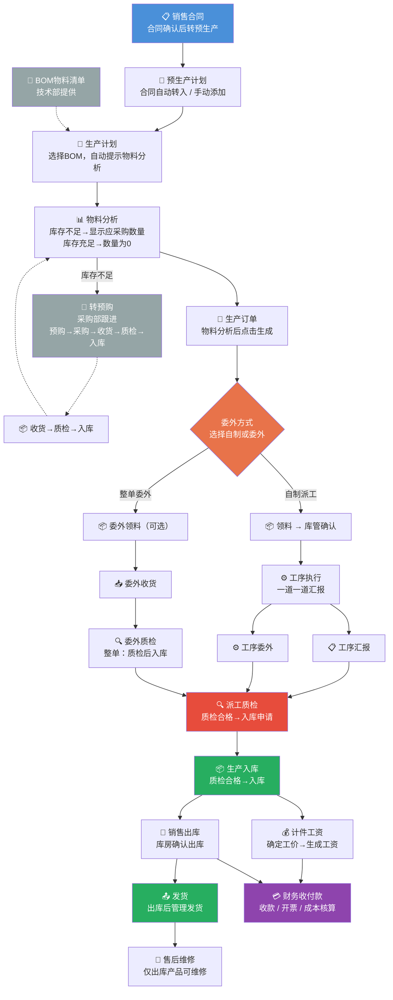

---
tags:
  - SUEL
  - ERP
  - 智邦国际
  - MOC
created: 2026-04-24
source: 福州速易联电气有限公司-实施方案.pdf（203页）
---

# 智邦国际 ERP 系统操作总览

> **系统**：智邦国际 ERP
> **适用公司**：福州速易联电气有限公司（SUEL）
> **文档来源**：实施方案 v1.0（2025-01-05，实施部-郭毅）
> **原文PDF**：福州速易联电气有限公司-实施方案

---

## 📥 上线准备

> 📋 [[13-上线准备手册|上线准备手册]] — 系统上线前全部配置工作，含操作截图、准备资料、进度跟踪表（六阶段22项）
> 🔑 [[14-权限分配矩阵|权限分配矩阵]] — 5角色×10模块完整权限矩阵，含20个权限模板建议及审批链配置

---

## 流程总览

> 📊 [[流程图/生产一体化流程图|生产一体化流程图]] ｜ [[流程图/采购一体化流程图|采购一体化流程图]] ｜ [[流程图/库存一体化流程图|库存一体化流程图]] ｜ [[流程图/销售一体化流程图|销售一体化流程图]] ｜ [[流程图/研发一体化流程图|研发一体化流程图]] ｜ [[流程图/人资一体化流程图|人资一体化流程图]]（Mermaid 流程图）

### 核心业务流程链

---

## 模块导航

### 一、[[01-基础信息建立操作指南|基础信息建立]]
系统上线前的初始配置（11项），由管理员完成。详见 → [[13-上线准备手册|上线准备手册]]

### 二、[[02-销售部操作指南\|销售部]]
客户管理、项目→报价→合同→出库全流程

### 三、[[03-技术部操作指南\|技术部]]
工艺流程、产品设计、物料清单

### 四、[[04-采购部操作指南\|采购部]]
供应商管理、采购→收货→质检→付款

### 五、[[05-生产部操作指南\|生产部]]
生产计划、派工、工序执行、委外、计件工资（最复杂模块）

### 六、[[06-质检部操作指南\|质检部]]
来料质检、生产质检、委外质检

### 七、[[07-库房操作指南\|库房]]
入库/出库/发货/盘点/调拨/组装拆装/借货

### 八、[[08-财务部操作指南\|财务部]]
总账、收付款、开收票、费用、固定资产、成本管理、成本核算

### 九、[[09-售后部操作指南\|售后部]]
售后流程、受理单、维修

### 十、[[10-人资部操作指南\|人资部]]
档案、考勤、招聘、工资、人事调动

### 十一、[[11-办公管理操作指南\|办公管理]]
公告、工作互动、文档、日程、办公用品、会议室

### 十二、[[12-管理层查询操作指南\|管理层查询]]
舰长瞭望台、控制台、财务分析、经营报表

---

## 📚 原始PDF文档

> 所有原始PDF已存入 `pdfs/` 目录，可在Obsidian中直接打开查看。

| 资源 | 链接 |
|------|------|
| 📄 实施方案（203页） | !实施方案 |
| 📄 基础信息建立 | !基础信息建立 |
| 📄 销售流程 | !销售流程 |
| 📄 技术流程 | !技术流程 |
| 📄 采购流程 | !采购流程 |
| 📄 生产流程 | !生产流程 |
| 📄 质检流程 | !质检流程 |
| 📄 仓库流程 | !仓库流程 |
| 📄 财务流程 | !财务流程 |
| 📄 售后流程 | !售后流程 |
| 📄 人资流程 | !人资流程 |
| 📄 办公管理 | !办公管理 |
| 📄 管理层查询 | !管理层查询 |
| 🎬 各流程视频学习二维码 | !视频学习二维码 |

## 常用链接

| 资源 | 地址 |
|------|------|
| 📂 原始PDF目录 | `E:\02-工作资料\SUEL\新erp各部门操作流程(1)\新erp各部门操作流程\` |
| 📂 交接资料目录 | `E:\02-工作资料\SUEL\交接资料\` |
| 培训中心视频 | 扫码听课 |
| 客户成功中心 | http://partner.zbintel.com/ |
| 客户帮助中心 | http://service.zbintel.com |

## 联系方式

| 类型 | 信息 |
|------|------|
| 400热线 | 400-650-8060 |
| 客服中心 | 010-86391518 转1 |
| 咨询邮箱 | market@zbintel.com |
| 售后邮箱 | service@zbintel.com |
| 官网 | http://www.zbintel.com |
