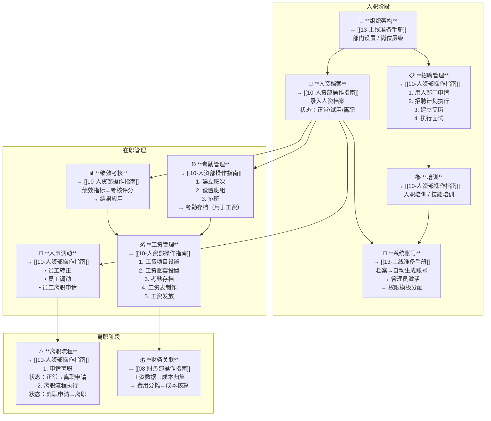

# 人资一体化流程图

**速易联 ERP · SUEL**

```mermaid
flowchart TD
    subgraph 入职阶段
        company["🏢 **组织架构**\n→ [[13-上线准备手册]]\n部门设置 / 岗位层级"]
        recruit["📋 **招聘管理**\n→ [[10-人资部操作指南]]\n1. 用人部门申请\n2. 招聘计划执行\n3. 建立简历\n4. 执行面试"]
        training["📚 **培训**\n→ [[10-人资部操作指南]]\n入职培训 / 技能培训"]
        archive["📁 **人资档案**\n→ [[10-人资部操作指南]]\n录入人资档案\n状态：正常/试用/离职"]
        account["🔐 **系统账号**\n→ [[13-上线准备手册]]\n档案→自动生成账号\n→ 管理员激活\n→ 权限模板分配"]
    end

    subgraph 在职管理
        attendance["⏰ **考勤管理**\n→ [[10-人资部操作指南]]\n1. 建立班次\n2. 设置班组\n3. 排班\n→ 考勤存档（用于工资）"]
        performance["📊 **绩效考核**\n→ [[10-人资部操作指南]]\n绩效指标→考核评分\n→ 结果应用"]
        salary["💰 **工资管理**\n→ [[10-人资部操作指南]]\n1. 工资项目设置\n2. 工资账套设置\n3. 考勤存档\n4. 工资表制作\n5. 工资发放"]
        hr_change["🔄 **人事调动**\n→ [[10-人资部操作指南]]\n• 员工转正\n• 员工调动\n• 员工离职申请"]
    end

    subgraph 离职阶段
        resignation["⚠️ **离职流程**\n→ [[10-人资部操作指南]]\n1. 申请离职\n   状态：正常→离职申请\n2. 离职流程执行\n   状态：离职申请→离职"]
        finance_link["💰 **财务关联**\n→ [[08-财务部操作指南]]\n工资数据→成本归集\n→ 费用分摊→成本核算"]
    end

    company --> recruit
    recruit --> training
    training --> account
    company --> archive
    archive --> account
    archive --> attendance
    archive --> performance
    archive --> hr_change
    attendance --> salary
    performance --> salary
    hr_change --> resignation
    salary --> finance_link
```
