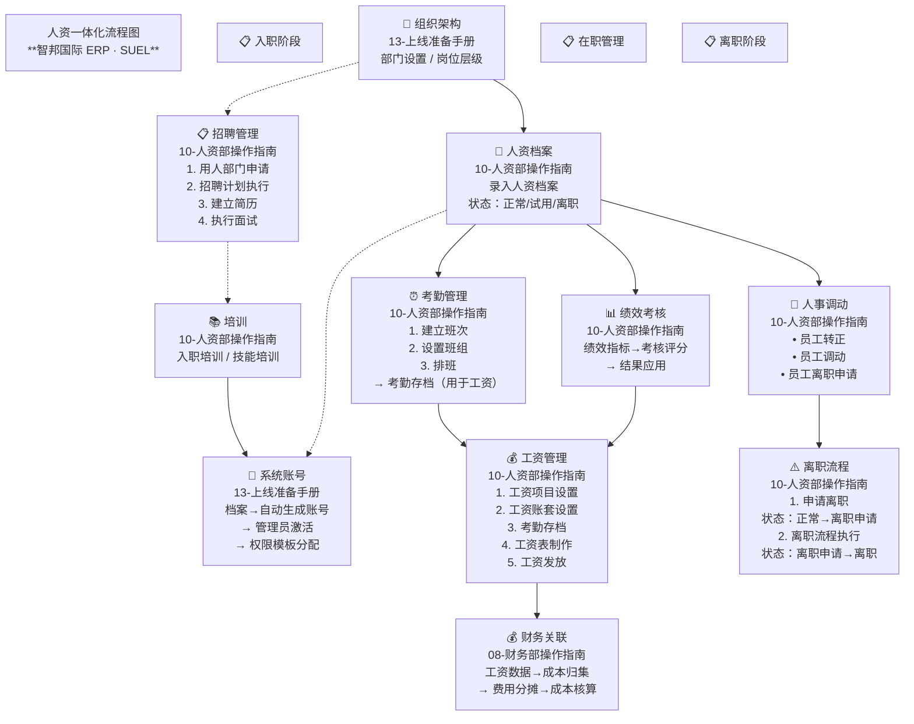

```mermaid
flowchart TD
    archive["📁 人资档案<br>10-人资部操作指南<br>录入人资档案<br>状态：正常/试用/离职"]
    click archive "../10-人资部操作指南"
    attendance["⏰ 考勤管理<br>10-人资部操作指南<br>1. 建立班次<br>2. 设置班组<br>3. 排班<br>→ 考勤存档（用于工资）"]
    click attendance "../10-人资部操作指南"
    performance["📊 绩效考核<br>10-人资部操作指南<br>绩效指标→考核评分<br>→ 结果应用"]
    click performance "../10-人资部操作指南"
    salary["💰 工资管理<br>10-人资部操作指南<br>1. 工资项目设置<br>2. 工资账套设置<br>3. 考勤存档<br>4. 工资表制作<br>5. 工资发放"]
    click salary "../10-人资部操作指南"
    hr_change["🔄 人事调动<br>10-人资部操作指南<br>• 员工转正<br>• 员工调动<br>• 员工离职申请"]
    click hr_change "../10-人资部操作指南"
    title["人资一体化流程图<br>**智邦国际 ERP · SUEL**"]
    recruit["📋 招聘管理<br>10-人资部操作指南<br>1. 用人部门申请<br>2. 招聘计划执行<br>3. 建立简历<br>4. 执行面试"]
    click recruit "../10-人资部操作指南"
    account["🔐 系统账号<br>13-上线准备手册<br>档案→自动生成账号<br>→ 管理员激活<br>→ 权限模板分配"]
    click account "../13-上线准备手册"
    phase1_label["📋 入职阶段"]
    company["🏢 组织架构<br>13-上线准备手册<br>部门设置 / 岗位层级"]
    click company "../13-上线准备手册"
    training["📚 培训<br>10-人资部操作指南<br>入职培训 / 技能培训"]
    click training "../10-人资部操作指南"
    phase2_label["📋 在职管理"]
    resignation["⚠️ 离职流程<br>10-人资部操作指南<br>1. 申请离职<br>   状态：正常→离职申请<br>2. 离职流程执行<br>   状态：离职申请→离职"]
    click resignation "../10-人资部操作指南"
    finance_link["💰 财务关联<br>08-财务部操作指南<br>工资数据→成本归集<br>→ 费用分摊→成本核算"]
    click finance_link "../08-财务部操作指南"
    phase3_label["📋 离职阶段"]

    company -.->| | recruit
    recruit -.->| | training
    training --> account
    company --> archive
    archive -.->| | account
    archive --> attendance
    archive --> performance
    attendance --> salary
    performance --> salary
    archive --> hr_change
    hr_change --> resignation
    salary --> finance_link
```