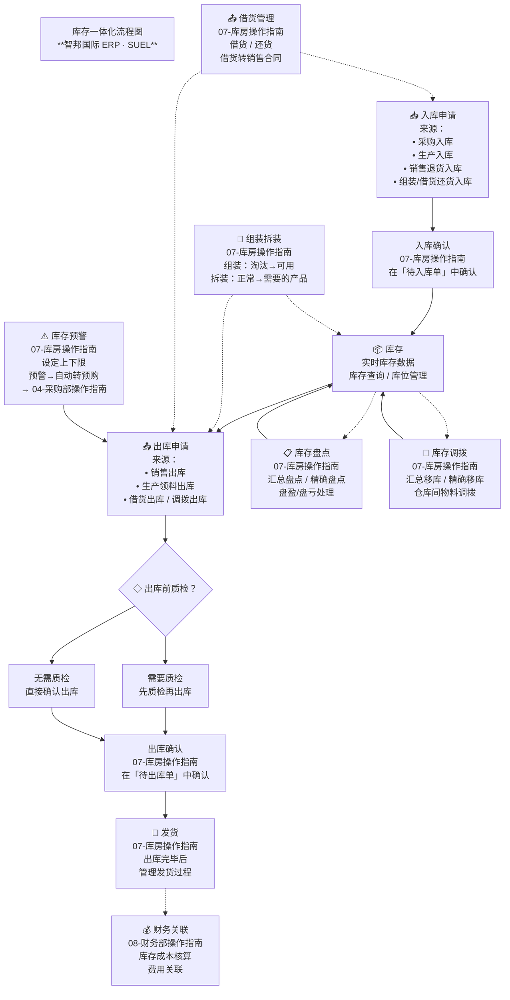

```mermaid
flowchart TD
    title["库存一体化流程图<br>**智邦国际 ERP · SUEL**"]
    inbound_apply["📥 入库申请<br>来源：<br>• 采购入库<br>• 生产入库<br>• 销售退货入库<br>• 组装/借货还货入库"]
    inbound_confirm["入库确认<br>07-库房操作指南<br>在「待入库单」中确认"]
    click inbound_confirm "../07-库房操作指南"
    inventory["📦 库存<br>实时库存数据<br>库存查询 / 库位管理"]
    outbound_apply["📤 出库申请<br>来源：<br>• 销售出库<br>• 生产领料出库<br>• 借货出库 / 调拨出库"]
    qc_yes["需要质检<br>先质检再出库"]
    qc_no["无需质检<br>直接确认出库"]
    outbound_confirm["出库确认<br>07-库房操作指南<br>在「待出库单」中确认"]
    click outbound_confirm "../07-库房操作指南"
    stocktake["📋 库存盘点<br>07-库房操作指南<br>汇总盘点 / 精确盘点<br>盘盈/盘亏处理"]
    click stocktake "../07-库房操作指南"
    transfer["🔄 库存调拨<br>07-库房操作指南<br>汇总移库 / 精确移库<br>仓库间物料调拨"]
    click transfer "../07-库房操作指南"
    assembly["🔧 组装拆装<br>07-库房操作指南<br>组装：淘汰→可用<br>拆装：正常→需要的产品"]
    click assembly "../07-库房操作指南"
    borrow["📤 借货管理<br>07-库房操作指南<br>借货 / 还货<br>借货转销售合同"]
    click borrow "../07-库房操作指南"
    warning["⚠️ 库存预警<br>07-库房操作指南<br>设定上下限<br>预警→自动转预购<br>→ 04-采购部操作指南"]
    click warning "../07-库房操作指南"
    click warning "../04-采购部操作指南"
    finance["💰 财务关联<br>08-财务部操作指南<br>库存成本核算<br>费用关联"]
    click finance "../08-财务部操作指南"
    ship["🚚 发货<br>07-库房操作指南<br>出库完毕后<br>管理发货过程"]
    click ship "../07-库房操作指南"
    outbound_qc{◇ 出库前质检？}

    inbound_apply --> inbound_confirm
    inbound_confirm --> inventory
    inventory --> outbound_apply
    outbound_apply --> outbound_qc
    outbound_qc --> qc_yes
    outbound_qc --> qc_no
    qc_yes --> outbound_confirm
    qc_no --> outbound_confirm
    outbound_confirm --> ship
    inventory -.->| | stocktake
    stocktake --> inventory
    inventory -.->| | transfer
    transfer --> inventory
    assembly -.->| | inventory
    assembly -.->| | outbound_apply
    borrow -.->| | outbound_apply
    borrow -.->| | inbound_apply
    warning --> outbound_apply
    ship -.->| | finance
```