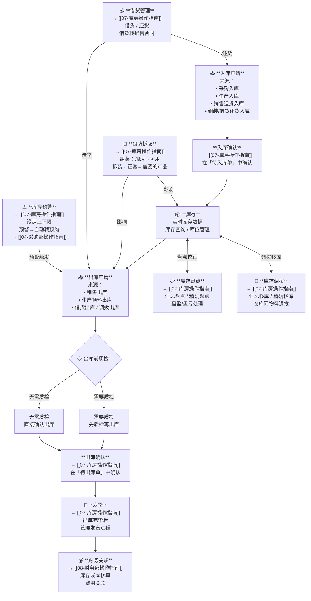

# 库存一体化流程图

**速易联 ERP · SUEL**

```mermaid
flowchart TD
    inbound_apply["📥 **入库申请**\n来源：\n• 采购入库\n• 生产入库\n• 销售退货入库\n• 组装/借货还货入库"]
    inbound_confirm["**入库确认**\n→ [[07-库房操作指南]]\n在「待入库单」中确认"]
    inventory["📦 **库存**\n实时库存数据\n库存查询 / 库位管理"]
    outbound_apply["📤 **出库申请**\n来源：\n• 销售出库\n• 生产领料出库\n• 借货出库 / 调拨出库"]
    outbound_qc{"◇ 出库前质检？"}
    qc_yes["需要质检\n先质检再出库"]
    qc_no["无需质检\n直接确认出库"]
    outbound_confirm["**出库确认**\n→ [[07-库房操作指南]]\n在「待出库单」中确认"]
    ship["🚚 **发货**\n→ [[07-库房操作指南]]\n出库完毕后\n管理发货过程"]
    finance["💰 **财务关联**\n→ [[08-财务部操作指南]]\n库存成本核算\n费用关联"]

    stocktake["📋 **库存盘点**\n→ [[07-库房操作指南]]\n汇总盘点 / 精确盘点\n盘盈/盘亏处理"]
    transfer["🔄 **库存调拨**\n→ [[07-库房操作指南]]\n汇总移库 / 精确移库\n仓库间物料调拨"]
    assembly["🔧 **组装拆装**\n→ [[07-库房操作指南]]\n组装：淘汰→可用\n拆装：正常→需要的产品"]
    borrow["📤 **借货管理**\n→ [[07-库房操作指南]]\n借货 / 还货\n借货转销售合同"]
    warning["⚠️ **库存预警**\n→ [[07-库房操作指南]]\n设定上下限\n预警→自动转预购\n→ [[04-采购部操作指南]]"]

    inbound_apply --> inbound_confirm
    inbound_confirm --> inventory
    inventory --> outbound_apply
    outbound_apply --> outbound_qc
    outbound_qc -->|需要质检| qc_yes
    outbound_qc -->|无需质检| qc_no
    qc_yes --> outbound_confirm
    qc_no --> outbound_confirm
    outbound_confirm --> ship
    ship --> finance

    inventory <-->|盘点校正| stocktake
    inventory <-->|调拨移库| transfer
    assembly -->|影响| inventory
    assembly -->|影响| outbound_apply
    borrow -->|借货| outbound_apply
    borrow -->|还货| inbound_apply
    warning -->|预警触发| outbound_apply
```
