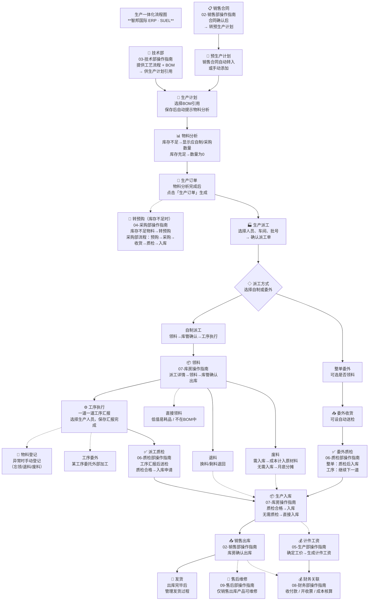

```mermaid
flowchart TD
    title["生产一体化流程图<br>**智邦国际 ERP · SUEL**"]
    sale_contract["📋 销售合同<br>02-销售部操作指南<br>合同确认后<br>→ 转预生产计划"]
    click sale_contract "../02-销售部操作指南"
    tech_bom["🔧 技术部<br>03-技术部操作指南<br>提供工艺流程 + BOM<br>→ 供生产计划引用"]
    click tech_bom "../03-技术部操作指南"
    pre_plan["📝 预生产计划<br>销售合同自动转入<br>或手动添加"]
    prod_plan["📝 生产计划<br>选择BOM引用<br>保存后自动提示物料分析"]
    mat_analysis["📊 物料分析<br>库存不足→显示应自制/采购数量<br>库存充足→数量为0"]
    prod_order["📄 生产订单<br>物料分析完成后<br>点击「生产订单」生成"]
    pre_purchase["🛒 转预购（库存不足时）<br>04-采购部操作指南<br>库存不足物料→转预购<br>采购部流程：预购→采购→收货→质检→入库"]
    click pre_purchase "../04-采购部操作指南"
    dispatch["🏭 生产派工<br>选择人员、车间、批号<br>→ 确认派工单"]
    branch{◇ 派工方式<br>选择自制或委外}
    self_dispatch["自制派工<br>领料→库管确认→工序执行"]
    outsource_dispatch["整单委外<br>可选是否领料"]
    pick_material["📦 领料<br>07-库房操作指南<br>派工详情→领料→库管确认出库"]
    click pick_material "../07-库房操作指南"
    outsource_recv["📥 委外收货<br>可设自动送检"]
    process_exec["⚙️ 工序执行<br>一道一道工序汇报<br>选择生产人员，保存汇报完成"]
    mat_register["📝 物料登记<br>异常时手动登记<br>（忘领/退料/废料）"]
    direct_pick["直接领料<br>低值易耗品 / 不在BOM中"]
    process_outsource["工序委外<br>某工序委托外部加工"]
    qc_dispatch["✅ 派工质检<br>06-质检部操作指南<br>工序汇报后送检<br>质检合格→入库申请"]
    click qc_dispatch "../06-质检部操作指南"
    qc_outsource["✅ 委外质检<br>06-质检部操作指南<br>整单：质检后入库<br>工序：继续下一道"]
    click qc_outsource "../06-质检部操作指南"
    warehouse_in["📦 生产入库<br>07-库房操作指南<br>质检合格→入库<br>无需质检→直接入库"]
    click warehouse_in "../07-库房操作指南"
    mat_return["退料<br>换料/剩料退回"]
    mat_scrap["废料<br>需入库→成本计入原材料<br>无需入库→月底分摊"]
    sale_out["📤 销售出库<br>02-销售部操作指南<br>库房确认出库"]
    click sale_out "../02-销售部操作指南"
    after_sale["🔧 售后维修<br>09-售后部操作指南<br>仅销售出库产品可维修"]
    click after_sale "../09-售后部操作指南"
    ship["🚚 发货<br>出库完毕后<br>管理发货过程"]
    wage["💰 计件工资<br>05-生产部操作指南<br>确定工价→生成计件工资"]
    click wage "../05-生产部操作指南"
    finance["💰 财务关联<br>08-财务部操作指南<br>收付款 / 开收票 / 成本核算"]
    click finance "../08-财务部操作指南"

    sale_contract --> pre_plan
    tech_bom --> prod_plan
    pre_plan --> prod_plan
    prod_plan --> mat_analysis
    mat_analysis --> prod_order
    prod_order -.->| | pre_purchase
    prod_order --> dispatch
    dispatch --> branch
    branch --> self_dispatch
    branch --> outsource_dispatch
    self_dispatch --> pick_material
    outsource_dispatch --> outsource_recv
    pick_material --> process_exec
    pick_material -.->| | direct_pick
    process_exec -.->| | mat_register
    process_exec -.->| | process_outsource
    process_exec --> qc_dispatch
    outsource_recv --> qc_outsource
    qc_dispatch --> warehouse_in
    qc_outsource --> warehouse_in
    warehouse_in --> sale_out
    sale_out --> ship
    sale_out -.->| | after_sale
    warehouse_in -.->| | wage
    wage --> finance
    sale_out -.->| | finance
    pick_material --> mat_return
    pick_material --> mat_scrap
    mat_return -.->| | warehouse_in
    mat_scrap -.->| | warehouse_in
```