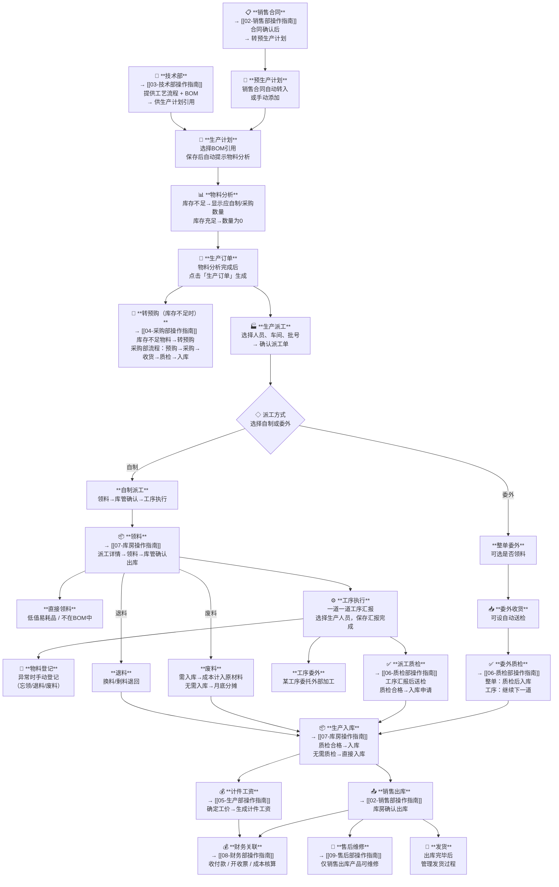

# 生产一体化流程图

**速易联 ERP · SUEL**

```mermaid
flowchart TD
    sale_contract["📋 **销售合同**\n→ [[02-销售部操作指南]]\n合同确认后\n→ 转预生产计划"]
    tech_bom["🔧 **技术部**\n→ [[03-技术部操作指南]]\n提供工艺流程 + BOM\n→ 供生产计划引用"]
    pre_plan["📝 **预生产计划**\n销售合同自动转入\n或手动添加"]
    prod_plan["📝 **生产计划**\n选择BOM引用\n保存后自动提示物料分析"]
    mat_analysis["📊 **物料分析**\n库存不足→显示应自制/采购数量\n库存充足→数量为0"]
    prod_order["📄 **生产订单**\n物料分析完成后\n点击「生产订单」生成"]
    pre_purchase["🛒 **转预购（库存不足时）**\n→ [[04-采购部操作指南]]\n库存不足物料→转预购\n采购部流程：预购→采购→收货→质检→入库"]
    dispatch["🏭 **生产派工**\n选择人员、车间、批号\n→ 确认派工单"]
    branch{"◇ 派工方式\n选择自制或委外"}
    self_dispatch["**自制派工**\n领料→库管确认→工序执行"]
    outsource_dispatch["**整单委外**\n可选是否领料"]
    direct_pick["**直接领料**\n低值易耗品 / 不在BOM中"]
    pick_material["📦 **领料**\n→ [[07-库房操作指南]]\n派工详情→领料→库管确认出库"]
    mat_register["📝 **物料登记**\n异常时手动登记\n（忘领/退料/废料）"]
    mat_return["**退料**\n换料/剩料退回"]
    mat_scrap["**废料**\n需入库→成本计入原材料\n无需入库→月底分摊"]
    process_exec["⚙️ **工序执行**\n一道一道工序汇报\n选择生产人员，保存汇报完成"]
    process_outsource["**工序委外**\n某工序委托外部加工"]
    outsource_recv["📥 **委外收货**\n可设自动送检"]
    qc_dispatch["✅ **派工质检**\n→ [[06-质检部操作指南]]\n工序汇报后送检\n质检合格→入库申请"]
    qc_outsource["✅ **委外质检**\n→ [[06-质检部操作指南]]\n整单：质检后入库\n工序：继续下一道"]
    warehouse_in["📦 **生产入库**\n→ [[07-库房操作指南]]\n质检合格→入库\n无需质检→直接入库"]
    wage["💰 **计件工资**\n→ [[05-生产部操作指南]]\n确定工价→生成计件工资"]
    sale_out["📤 **销售出库**\n→ [[02-销售部操作指南]]\n库房确认出库"]
    after_sale["🔧 **售后维修**\n→ [[09-售后部操作指南]]\n仅销售出库产品可维修"]
    ship["🚚 **发货**\n出库完毕后\n管理发货过程"]
    finance["💰 **财务关联**\n→ [[08-财务部操作指南]]\n收付款 / 开收票 / 成本核算"]

    sale_contract --> pre_plan
    tech_bom --> prod_plan
    pre_plan --> prod_plan
    prod_plan --> mat_analysis
    mat_analysis --> prod_order
    prod_order --> pre_purchase
    prod_order --> dispatch
    dispatch --> branch
    branch -->|自制| self_dispatch
    branch -->|委外| outsource_dispatch
    self_dispatch --> pick_material
    outsource_dispatch --> outsource_recv
    pick_material --> direct_pick
    pick_material --> process_exec
    pick_material -->|退料| mat_return
    pick_material -->|废料| mat_scrap
    process_exec --> mat_register
    process_exec --> process_outsource
    process_exec --> qc_dispatch
    outsource_recv --> qc_outsource
    mat_return --> warehouse_in
    mat_scrap --> warehouse_in
    qc_dispatch --> warehouse_in
    qc_outsource --> warehouse_in
    warehouse_in --> wage
    warehouse_in --> sale_out
    sale_out --> after_sale
    sale_out --> ship
    wage --> finance
    sale_out --> finance
```
