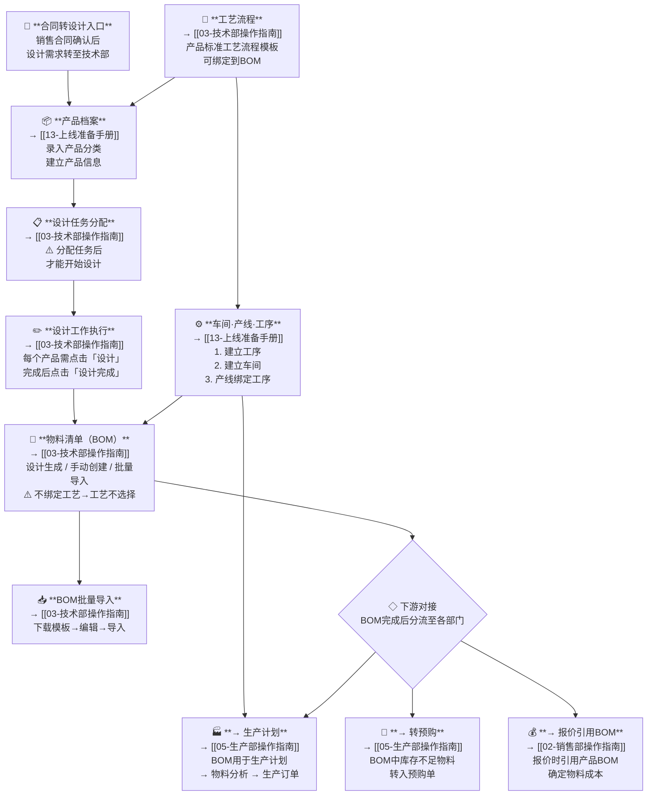

# 研发一体化流程图

**速易联 ERP · SUEL**

```mermaid
flowchart TD
    contract_entry["🔗 **合同转设计入口**\n销售合同确认后\n设计需求转至技术部"]
    product["📦 **产品档案**\n→ [[13-上线准备手册]]\n录入产品分类\n建立产品信息"]
    design_task["📋 **设计任务分配**\n→ [[03-技术部操作指南]]\n⚠️ 分配任务后\n才能开始设计"]
    design_exec["✏️ **设计工作执行**\n→ [[03-技术部操作指南]]\n每个产品需点击「设计」\n完成后点击「设计完成」"]
    bom["📄 **物料清单（BOM）**\n→ [[03-技术部操作指南]]\n设计生成 / 手动创建 / 批量导入\n⚠️ 不绑定工艺→工艺不选择"]
    bom_import["📥 **BOM批量导入**\n→ [[03-技术部操作指南]]\n下载模板→编辑→导入"]
    process["🔧 **工艺流程**\n→ [[03-技术部操作指南]]\n产品标准工艺流程模板\n可绑定到BOM"]
    process_detail["⚙️ **车间·产线·工序**\n→ [[13-上线准备手册]]\n1. 建立工序\n2. 建立车间\n3. 产线绑定工序"]
    downstream{"◇ 下游对接\nBOM完成后分流至各部门"}
    to_production["🏭 **→ 生产计划**\n→ [[05-生产部操作指南]]\nBOM用于生产计划\n→ 物料分析 → 生产订单"]
    to_purchase["🛒 **→ 转预购**\n→ [[05-生产部操作指南]]\nBOM中库存不足物料\n转入预购单"]
    to_sales["💰 **→ 报价引用BOM**\n→ [[02-销售部操作指南]]\n报价时引用产品BOM\n确定物料成本"]

    contract_entry --> product
    product --> design_task
    design_task --> design_exec
    design_exec --> bom
    bom --> bom_import
    process --> product
    process --> process_detail
    process_detail --> bom
    process_detail --> to_production
    bom --> downstream
    downstream --> to_production
    downstream --> to_purchase
    downstream --> to_sales
```
