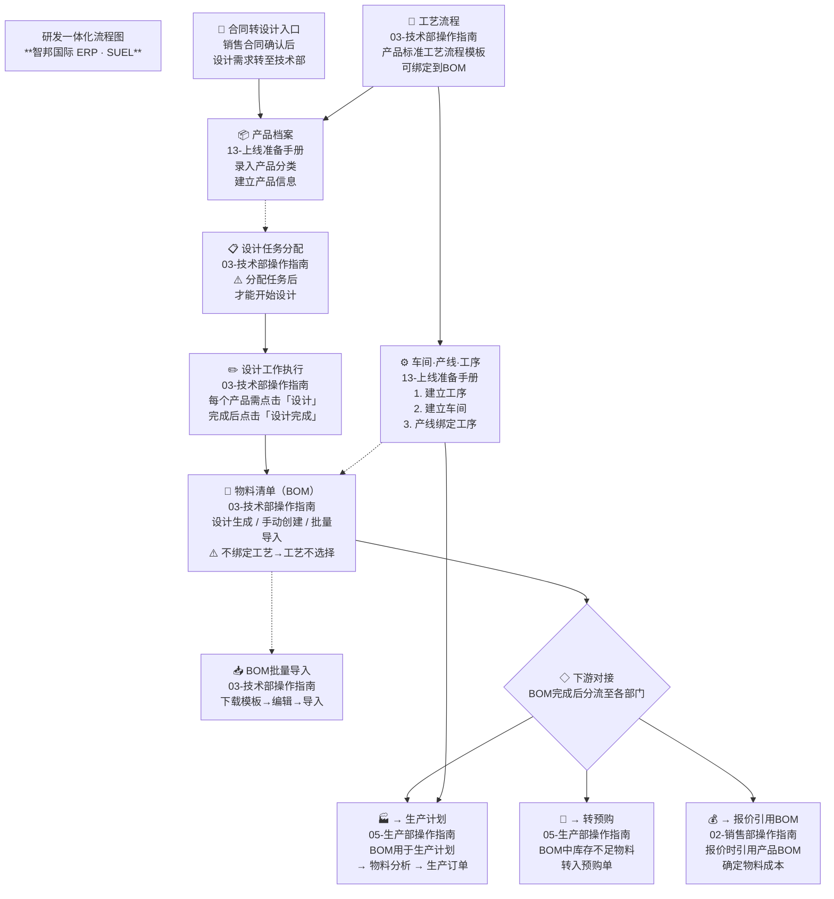

```mermaid
flowchart TD
    title["研发一体化流程图<br>**智邦国际 ERP · SUEL**"]
    product["📦 产品档案<br>13-上线准备手册<br>录入产品分类<br>建立产品信息"]
    click product "../13-上线准备手册"
    design_task["📋 设计任务分配<br>03-技术部操作指南<br>⚠️ 分配任务后<br>才能开始设计"]
    click design_task "../03-技术部操作指南"
    design_exec["✏️ 设计工作执行<br>03-技术部操作指南<br>每个产品需点击「设计」<br>完成后点击「设计完成」"]
    click design_exec "../03-技术部操作指南"
    bom["📄 物料清单（BOM）<br>03-技术部操作指南<br>设计生成 / 手动创建 / 批量导入<br>⚠️ 不绑定工艺→工艺不选择"]
    click bom "../03-技术部操作指南"
    process["🔧 工艺流程<br>03-技术部操作指南<br>产品标准工艺流程模板<br>可绑定到BOM"]
    click process "../03-技术部操作指南"
    process_detail["⚙️ 车间·产线·工序<br>13-上线准备手册<br>1. 建立工序<br>2. 建立车间<br>3. 产线绑定工序"]
    click process_detail "../13-上线准备手册"
    contract_entry["🔗 合同转设计入口<br>销售合同确认后<br>设计需求转至技术部"]
    bom_import["📥 BOM批量导入<br>03-技术部操作指南<br>下载模板→编辑→导入"]
    click bom_import "../03-技术部操作指南"
    to_production["🏭 → 生产计划<br>05-生产部操作指南<br>BOM用于生产计划<br>→ 物料分析 → 生产订单"]
    click to_production "../05-生产部操作指南"
    to_sales["💰 → 报价引用BOM<br>02-销售部操作指南<br>报价时引用产品BOM<br>确定物料成本"]
    click to_sales "../02-销售部操作指南"
    to_purchase["🛒 → 转预购<br>05-生产部操作指南<br>BOM中库存不足物料<br>转入预购单"]
    click to_purchase "../05-生产部操作指南"
    downstream{◇ 下游对接<br>BOM完成后分流至各部门}

    contract_entry --> product
    product -.->| | design_task
    design_task --> design_exec
    design_exec --> bom
    bom -.->| | bom_import
    process --> product
    process --> process_detail
    process_detail -.->| | bom
    bom --> downstream
    downstream --> to_production
    downstream --> to_purchase
    downstream --> to_sales
    process_detail --> to_production
```