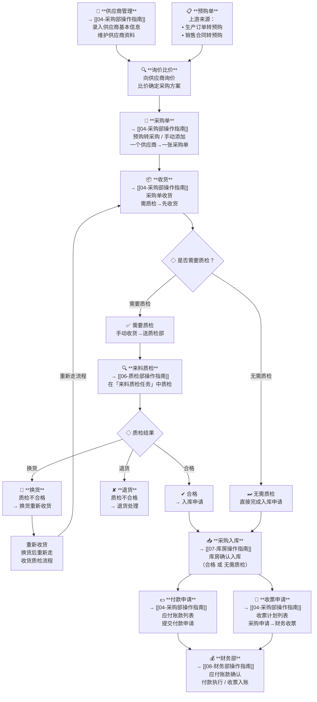

# 采购一体化流程图

**速易联 ERP · SUEL**

```mermaid
flowchart TD
    supplier["🏢 **供应商管理**\n→ [[04-采购部操作指南]]\n录入供应商基本信息\n维护供应商资料"]
    pre_purchase["📋 **预购单**\n上游来源：\n• 生产订单转预购\n• 销售合同转预购"]
    inquiry["🔍 **询价比价**\n向供应商询价\n比价确定采购方案"]
    purchase["📄 **采购单**\n→ [[04-采购部操作指南]]\n预购转采购 / 手动添加\n一个供应商→一张采购单"]
    receive["📦 **收货**\n→ [[04-采购部操作指南]]\n采购单收货\n需质检→先收货"]
    branch_qc{"◇ 是否需要质检？"}
    qc_yes["✅ 需要质检\n手动收货→送质检部"]
    qc_no["⏭ 无需质检\n直接完成入库申请"]
    incoming_qc["🔍 **来料质检**\n→ [[06-质检部操作指南]]\n在「来料质检任务」中质检"]
    qc_result{"◇ 质检结果"}
    qc_pass["✔ 合格\n→ 入库申请"]
    qc_return["✘ **退货**\n质检不合格\n→ 退货处理"]
    qc_exchange["🔄 **换货**\n质检不合格\n→ 换货重新收货"]
    exchange_loop["重新收货\n换货后重新走\n收货质检流程"]
    warehouse_in["📥 **采购入库**\n→ [[07-库房操作指南]]\n库房确认入库\n（合格 或 无需质检）"]
    pay_apply["💵 **付款申请**\n→ [[04-采购部操作指南]]\n应付账款列表\n提交付款申请"]
    invoice_apply["🧾 **收票申请**\n→ [[04-采购部操作指南]]\n收票计划列表\n采购申请→财务收票"]
    finance["💰 **财务部**\n→ [[08-财务部操作指南]]\n应付账款确认\n付款执行 / 收票入账"]

    supplier --> inquiry
    pre_purchase --> inquiry
    inquiry --> purchase
    purchase --> receive
    receive --> branch_qc
    branch_qc -->|需要质检| qc_yes
    branch_qc -->|无需质检| qc_no
    qc_yes --> incoming_qc
    incoming_qc --> qc_result
    qc_result -->|合格| qc_pass
    qc_result -->|退货| qc_return
    qc_result -->|换货| qc_exchange
    qc_exchange --> exchange_loop
    exchange_loop -->|重新走流程| receive
    qc_pass --> warehouse_in
    qc_no --> warehouse_in
    warehouse_in --> pay_apply
    warehouse_in --> invoice_apply
    pay_apply --> finance
    invoice_apply --> finance
```
