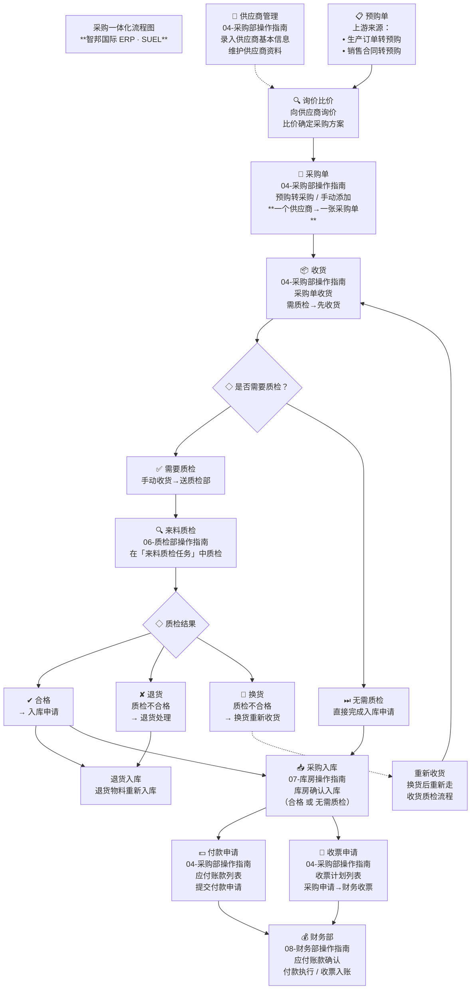

```mermaid
flowchart TD
    title["采购一体化流程图<br>**智邦国际 ERP · SUEL**"]
    supplier["🏢 供应商管理<br>04-采购部操作指南<br>录入供应商基本信息<br>维护供应商资料"]
    click supplier "../04-采购部操作指南"
    pre_purchase["📋 预购单<br>上游来源：<br>• 生产订单转预购<br>• 销售合同转预购"]
    inquiry["🔍 询价比价<br>向供应商询价<br>比价确定采购方案"]
    purchase["📄 采购单<br>04-采购部操作指南<br>预购转采购 / 手动添加<br>**一个供应商→一张采购单**"]
    click purchase "../04-采购部操作指南"
    receive["📦 收货<br>04-采购部操作指南<br>采购单收货<br>需质检→先收货"]
    click receive "../04-采购部操作指南"
    branch_qc{◇ 是否需要质检？}
    qc_yes["✅ 需要质检<br>手动收货→送质检部"]
    qc_no["⏭ 无需质检<br>直接完成入库申请"]
    incoming_qc["🔍 来料质检<br>06-质检部操作指南<br>在「来料质检任务」中质检"]
    click incoming_qc "../06-质检部操作指南"
    qc_pass["✔ 合格<br>→ 入库申请"]
    qc_return["✘ 退货<br>质检不合格<br>→ 退货处理"]
    qc_exchange["🔄 换货<br>质检不合格<br>→ 换货重新收货"]
    return_wh["退货入库<br>退货物料重新入库"]
    exchange_loop["重新收货<br>换货后重新走<br>收货质检流程"]
    warehouse_in["📥 采购入库<br>07-库房操作指南<br>库房确认入库<br>（合格 或 无需质检）"]
    click warehouse_in "../07-库房操作指南"
    pay_apply["💵 付款申请<br>04-采购部操作指南<br>应付账款列表<br>提交付款申请"]
    click pay_apply "../04-采购部操作指南"
    invoice_apply["🧾 收票申请<br>04-采购部操作指南<br>收票计划列表<br>采购申请→财务收票"]
    click invoice_apply "../04-采购部操作指南"
    finance["💰 财务部<br>08-财务部操作指南<br>应付账款确认<br>付款执行 / 收票入账"]
    click finance "../08-财务部操作指南"
    qc_result{◇ 质检结果}

    supplier -.->| | inquiry
    pre_purchase --> inquiry
    inquiry --> purchase
    purchase --> receive
    receive --> branch_qc
    branch_qc --> qc_yes
    branch_qc --> qc_no
    qc_yes --> incoming_qc
    incoming_qc --> qc_result
    qc_result --> qc_pass
    qc_result --> qc_return
    qc_result --> qc_exchange
    qc_pass --> return_wh
    qc_return --> return_wh
    qc_exchange -.->| | exchange_loop
    exchange_loop --> receive
    qc_pass --> warehouse_in
    qc_no --> warehouse_in
    warehouse_in --> pay_apply
    warehouse_in --> invoice_apply
    pay_apply --> finance
    invoice_apply --> finance
```