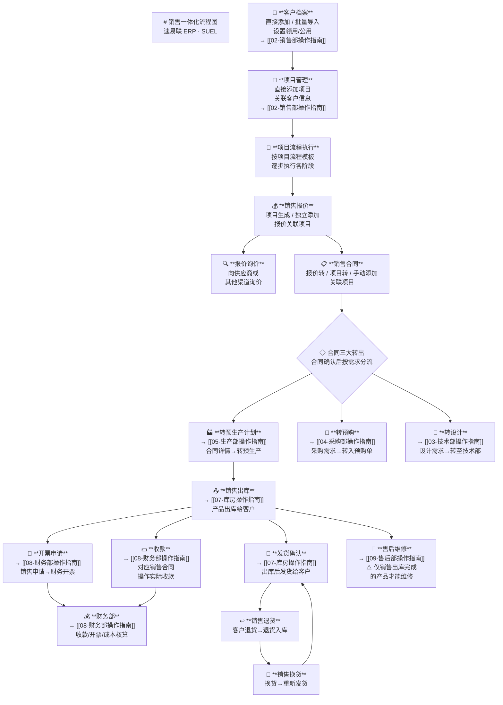

# 销售一体化流程图

**速易联 ERP · SUEL**

```mermaid
flowchart TD
    title["# 销售一体化流程图\n速易联 ERP · SUEL"]

    customer["👤 **客户档案**\n直接添加 / 批量导入\n设置领用/公用\n→ [[02-销售部操作指南]]"]
    project["📁 **项目管理**\n直接添加项目\n关联客户信息\n→ [[02-销售部操作指南]]"]
    project_exec["🔄 **项目流程执行**\n按项目流程模板\n逐步执行各阶段"]
    quote["💰 **销售报价**\n项目生成 / 独立添加\n报价关联项目"]
    inquiry["🔍 **报价询价**\n向供应商或\n其他渠道询价"]
    contract["📋 **销售合同**\n报价转 / 项目转 / 手动添加\n关联项目"]
    contract_branch{"◇ 合同三大转出\n合同确认后按需求分流"}
    to_production["🏭 **转预生产计划**\n→ [[05-生产部操作指南]]\n合同详情→转预生产"]
    to_purchase["🛒 **转预购**\n→ [[04-采购部操作指南]]\n采购需求→转入预购单"]
    to_design["🎨 **转设计**\n→ [[03-技术部操作指南]]\n设计需求→转至技术部"]
    outbound["📤 **销售出库**\n→ [[07-库房操作指南]]\n产品出库给客户"]
    invoice["🧾 **开票申请**\n→ [[08-财务部操作指南]]\n销售申请→财务开票"]
    receipt["💵 **收款**\n→ [[08-财务部操作指南]]\n对应销售合同\n操作实际收款"]
    shipment["🚚 **发货确认**\n→ [[07-库房操作指南]]\n出库后发货给客户"]
    aftermarket["🔧 **售后维修**\n→ [[09-售后部操作指南]]\n⚠️ 仅销售出库完成\n的产品才能维修"]
    finance["💰 **财务部**\n→ [[08-财务部操作指南]]\n收款/开票/成本核算"]
    return_goods["↩️ **销售退货**\n客户退货→退货入库"]
    exchange["🔄 **销售换货**\n换货→重新发货"]

    customer --> project
    project --> project_exec
    project_exec --> quote
    quote --> inquiry
    quote --> contract
    contract --> contract_branch
    contract_branch --> to_production
    contract_branch --> to_purchase
    contract_branch --> to_design
    to_production --> outbound
    outbound --> invoice
    outbound --> receipt
    outbound --> shipment
    outbound --> aftermarket
    invoice --> finance
    receipt --> finance
    shipment --> return_goods
    return_goods --> exchange
    exchange --> shipment
```
