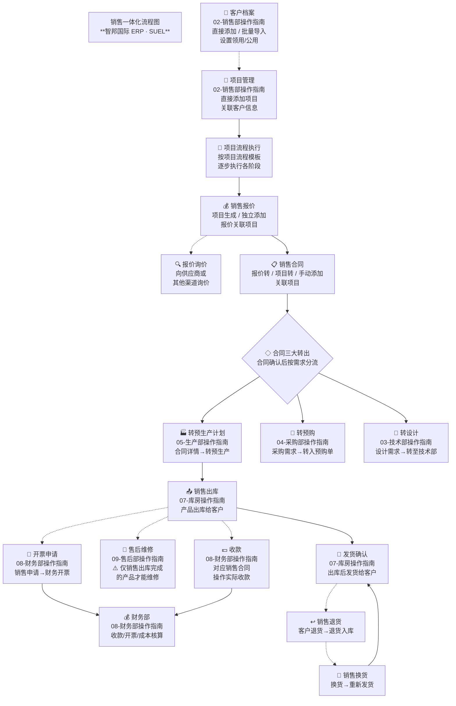

```mermaid
flowchart TD
    title["销售一体化流程图<br>**智邦国际 ERP · SUEL**"]
    customer["👤 客户档案<br>02-销售部操作指南<br>直接添加 / 批量导入<br>设置领用/公用"]
    click customer "../02-销售部操作指南"
    project["📁 项目管理<br>02-销售部操作指南<br>直接添加项目<br>关联客户信息"]
    click project "../02-销售部操作指南"
    quote["💰 销售报价<br>项目生成 / 独立添加<br>报价关联项目"]
    inquiry["🔍 报价询价<br>向供应商或<br>其他渠道询价"]
    contract_branch{◇ 合同三大转出<br>合同确认后按需求分流}
    to_production["🏭 转预生产计划<br>05-生产部操作指南<br>合同详情→转预生产"]
    click to_production "../05-生产部操作指南"
    to_purchase["🛒 转预购<br>04-采购部操作指南<br>采购需求→转入预购单"]
    click to_purchase "../04-采购部操作指南"
    to_design["🎨 转设计<br>03-技术部操作指南<br>设计需求→转至技术部"]
    click to_design "../03-技术部操作指南"
    receipt["💵 收款<br>08-财务部操作指南<br>对应销售合同<br>操作实际收款"]
    click receipt "../08-财务部操作指南"
    aftermarket["🔧 售后维修<br>09-售后部操作指南<br>⚠️ 仅销售出库完成<br>的产品才能维修"]
    click aftermarket "../09-售后部操作指南"
    project_exec["🔄 项目流程执行<br>按项目流程模板<br>逐步执行各阶段"]
    contract["📋 销售合同<br>报价转 / 项目转 / 手动添加<br>关联项目"]
    shipment["🚚 发货确认<br>07-库房操作指南<br>出库后发货给客户"]
    click shipment "../07-库房操作指南"
    invoice["🧾 开票申请<br>08-财务部操作指南<br>销售申请→财务开票"]
    click invoice "../08-财务部操作指南"
    outbound["📤 销售出库<br>07-库房操作指南<br>产品出库给客户"]
    click outbound "../07-库房操作指南"
    finance["💰 财务部<br>08-财务部操作指南<br>收款/开票/成本核算"]
    click finance "../08-财务部操作指南"
    exchange["🔄 销售换货<br>换货→重新发货"]
    return["↩️ 销售退货<br>客户退货→退货入库"]

    customer -.->| | project
    project --> project_exec
    project_exec --> quote
    quote -.->| | inquiry
    quote --> contract
    contract --> contract_branch
    contract_branch --> to_production
    contract_branch --> to_purchase
    contract_branch --> to_design
    to_production --> outbound
    outbound -.->| | invoice
    outbound -.->| | receipt
    outbound --> shipment
    outbound -.->| | aftermarket
    shipment -.->| | return
    return -.->| | exchange
    exchange --> shipment
    invoice --> finance
    receipt --> finance
```